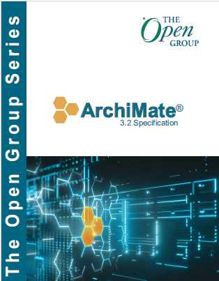
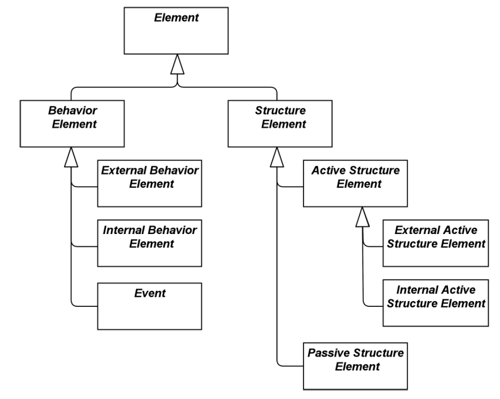
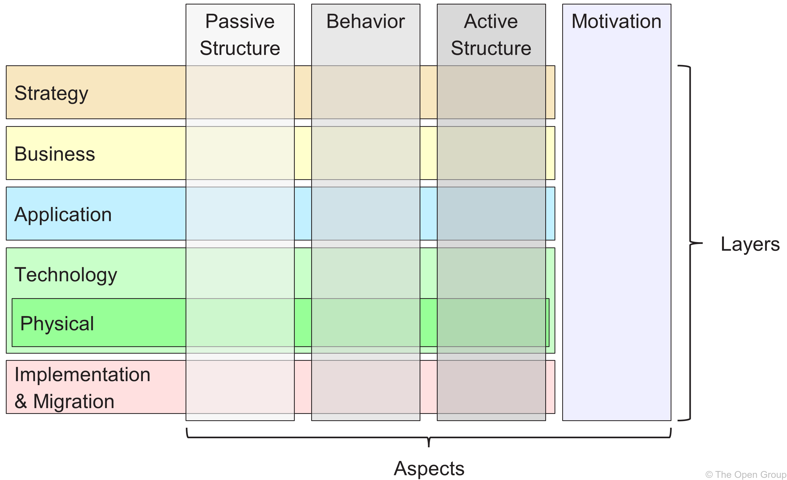
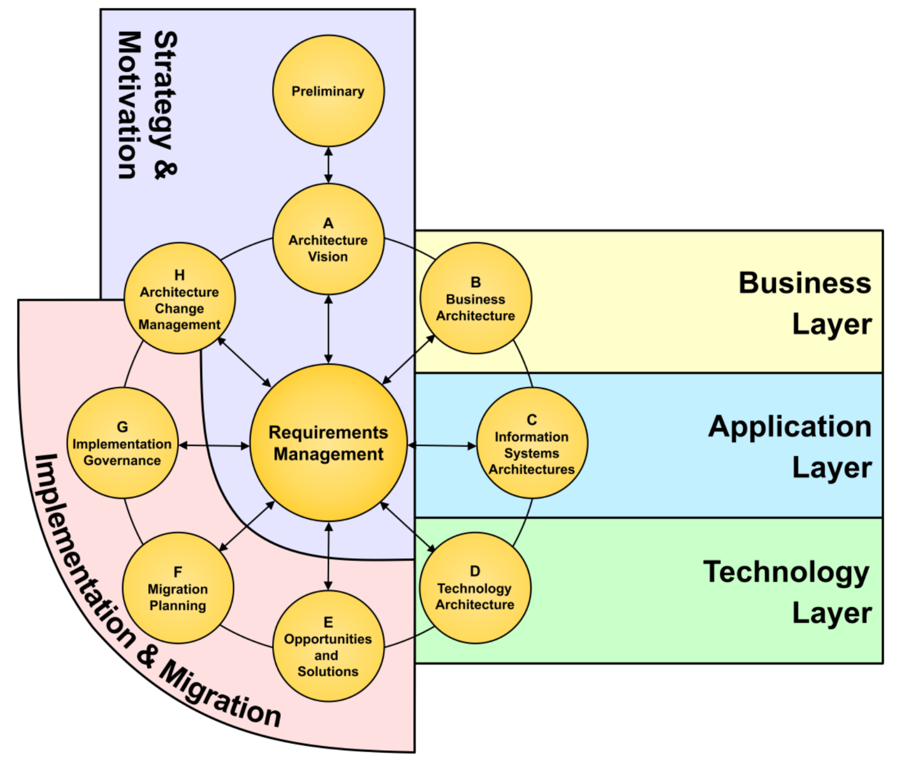
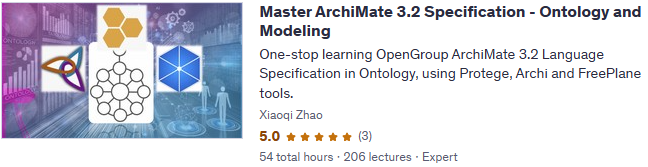

# 03 An Introduction to the ArchiMate® Language

## 03.1 Core Elements

The ArchiMate core elements belong to one of 3 categories (think about them from one graph / triple aspect):

 - Active Structure Elements (Subject)
 - Behavior Elements (Predicate)
 - Passive Structure Elements (Object)

Support _service-oriented_ viewpoints:

- Enternal Behavior Elements (Services)
- Internal Behavior Elements (Processes & Functions)
- External Active Structure Elements (Interfaces)
- Internal Active Structure Elements (Actors, Roles, Applications, Devices)

## 03.2 Core Relationships

Four relationships categories:

| Category | Purpose | Relationships |
| --- | --- | --- |
| Structural | Model the static construction or composition of elements | composition, aggregation, realization, assignment |
| Dependency | How elements support each other | serving, access, influence, association |
| Dynamic | Model information and control flows between elements | triggering, flow |
| Specialization | others | specializing |

The language __does not allow__ elements and relationships to be combined arbitrarily (任意地).

## 03.3 Extension Layers and Elements

- Strategy Layer (change to "Layer" from 3.2)
- Motivation Elements
- Implementation and Migration Layer
- Composition Elements

## 03.4 ArchiMate Language Customization

- User-Defined Attributes
- Sepcialization and "Stereotypes"
- Overloaded Relationships

## 03.5 The ArchiMate Full Framework

You already see this in [Chapter 1: Introduction](../01_Introduction/README.md):

Then below is the mapping of the ArchiMate Specification to the TOGAF Architecture Development Method (ADM):

## Some Learning Sources about ArchiMate

- ArchiMate Modeling Case Study - ArchiSurance
  - [Udemy - Archi (ArchiMate) Modeling Practices with ArchiSurance](https://www.udemy.com/course/archi-archimate-modeling-practices-with-archisurance/)
  - [Udemy - ArchiMate - ArchiSurance 4.3 - Modeling Practice (2025)](https://www.udemy.com/course/archimate-archisurance-modeling-practice-2025/)
  - [YouTube videolist - ArchiTool Modeling Practice - ArchiSurance (ArchiMate)](https://www.youtube.com/playlist?list=PL6DEHvciXKeXj1IlGBRB0KMaSv5Xt38uk)
- ArchiMate Modeling Case Study - ArchiMetal
  - [Udemy - Archi (ArchiMate) Modeling Practices with ArchiMetal](https://www.udemy.com/course/archi-archimate-modeling-practices-with-archimetal/)
  - [YouTube videolist - ArchiTool Modeling Practice - ArchiMetal (ArchiMate)](https://studio.youtube.com/playlist/PL6DEHvciXKeW_08V5guF_LIaxTOnx5b-s/edit)

Joint ArchiMate with Ontology in Modeling:

- [Udemy - Master ArchiMate 3.2 Specification - Ontology and Modeling](https://www.udemy.com/course/build-ontology-view-with-learning-archimate/?referralCode=6A3B23ADD67551B38D2B)
  
- [YouTube video list - Build Ontology View on ArchiMate 3.2 Language Meta-Model](https://studio.youtube.com/playlist/PL6DEHvciXKeUWWe--FiiSIyga0vt3kBpI/edit)

Welcome to have your support to my packaged course, well you may also view a series of those videos in YouTube as I'd like that can be shared more.

## About ArchiMate License and Trademark

Look at this post: https://ea.rna.nl/2016/05/23/is-archimate-an-open-standard-not-really/comment-page-1/ (Also I put [PDF version](./Is_ArchiMate_an_Open_Standard_Not_really.pdf) extracted)

---

[<button type="button">«Chapter 02</button>](../02_Rationale_of_Alignment/README.md) [<button type="button">Chapter 04»</button>](../04_Align_SABSA_and_ArchiMate_Framework/README.md) [<button type="button">HOME</button>](../README.md)

---

Any comments are welcome, feel free to raise pull-request or post in [Discussion Board](https://github.com/yasenstar/ArchiMate_SABSA/discussions)