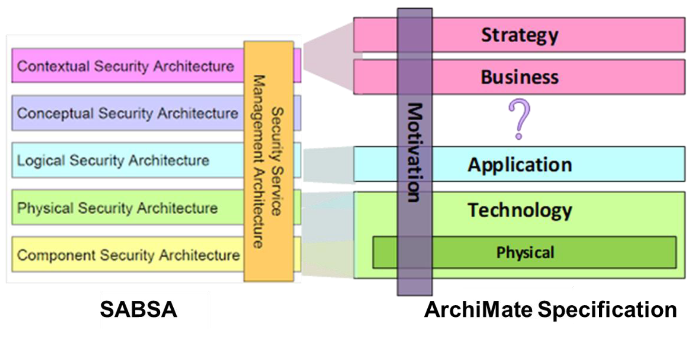

# 04 Alignment the SABSA and ArchiMate Frameworks

# 04.1 Introduction to the Security Overlay

The Security Overlay for the ArchiMate language focuses on extending the architectural layers and Motivation aspect to create a model-based framework for SABSA.

The Security Overlay for the ArchiMate langugae uses the inbuilt customization capabilities of the ArchiMate Specification to define a Security Overlay: a set of security profiles for existing ArchiMate elements, supplemented by a set of new stereotyped elements, to express security concepts.

Link https://sabsa.org/category/working-groups/modelling-sabsa-archimate/ is to the MSA Working Group (Modeling SABSA ArchiMate), it has one whitepaper but still in ArchiMate v2.01, you need to register as SABSA member to be allowed for downloading the resources. (Whitepaper is downloaded and can be read [here](./T100-Modelling-SABSA-with-ArchiMate_v2.01.pdf))

From SABSA perspective, back to upper link https://sabsa.org/category/working-groups/, you may find four Working Group which ArchiMate is one of them, I'm putting them briefly as below and would be take time to explore others once we've done this ArchiMate one first:

| ID | Working Group (SABSA) | Info & Updates |
| --- | --- | --- |
| WG100 | Security Services Catalogue (SSC) | https://sabsa.org/category/working-groups/security-services-catalogue |
| WG101 | SABSA Enhanced NIST Cybersecurity Framework (SENC) | https://sabsa.org/category/working-groups/sabsa-nist-csf/ |
| WG102 | SABSA Attributes Catalogue (SABAC) | https://sabsa.org/category/working-groups/sabsa-attributes-catalogue/ |
| WG103 | Modelling SABSA with ArchiMate (MSA) | https://sabsa.org/category/working-groups/modelling-sabsa-archimate/ |

## 04.2 An Overview of the Task

High-level perspective of aligning of SABSA and ArchiMate frameworks is as below (Figure 05 in Guide):

The left are the horizontal view for SABSA in 5 layers, looks like ArchiMate misses one "Concept" layer, while there's some other EA tooling may provide tailored meta-model that can fit the cross mapping.

Wierda recommended to partition the Architecture Description into three planes:

1. A primary (No.1) architecture showing how the Enterprise Architecture supports business processes at run-time
2. A secondary (No.2) management plane that shows how the primary (No.1) Enterprise Architecture is created, deployed, and operated
3. A tertiary (No.3) plane that deals with ownership, administration and goverannce

Base on SABSA Executive Summary Whitepaper, below is the SABSA MATRIX (Simplified):

| | ASSETS (What) | MOTIVATION (Why) | PROCESS (How) | PEOPLE (Who) | LOCATION (Where) | TIME (When) |
| --- | --- | --- | --- | --- | --- | --- |
| CONTEXTUAL ARCHITECTURE | Business Decisions | Business Risk | Business Processes | Business Governance | Business Geography | Business Time Dependence |
| CONCEPTUAL ARCHITECTURE | Business Knowledge & Risk Strategy | Risk Management Objectives | Strategies for Process Assurance | Roles & Responsibilites | Domain Framework | Time Management Framework |
| LOGICAL ARCHITECTURE | Information Assets | Risk Management Policies | Process Maps & Services | Entity & Trust Framework | Domain Maps | Calendar & Timetable |
| PHYSICAL ARCHITECTURE | Data Assets | Risk Management Practices | Process Mechanisms | Human Interface | ICT Infrastructure | Processing Schedule |
| COMPONENT ARCHITECTURE | ICT Components | Risk Management Tools & Standards | Process Tools & Standards | Personnel Management Tools & Standards | Locators Tools & Standards | Step Timing & Sequencing Tools |
| SERVICE MANAGEMENT ARCHITECTURE | Service Delivery Management | Operational Risk Management | Process Delivery Management | Personnel Management | Management of Environment | Time & Performance Management |

Those 6 pillars are in the same terminology to Zachman Framework, see below for comparison (sequence is not same):

| Audience Perspective | What | How | Where | Who | When | Why | Model Names |
| --- | --- | --- | --- | --- | --- | --- | --- |
| Executive Perspective | Inventory Identification | Process Identification | Distribution Identification | Responsibility Identification | Timing Identification | Motivation Identification | Scope Contexts |
| Business Management Perspective | Inventory Definition | Process Definition | Distribution Definition | Responsibility Definition | Timing Definition | Motivation Definition | Business Concepts |
| Architect Perspective | Inventory Representation | Process Representation | Distribution Representation | Responsibility Representation | Timing Representation | Motivation Repreventation | System Logic |
| Engineer Perspective | Inventory Specification | Process Specification | Distribution Specification | Responsibility Specification | Timing Specification | Motivation Specification | Technology Physics |
| Technician Perspective | Inventory Configuration | Process Configuration | Distribution Configuration | Responsibility Configuration | Timing Configuration | Motivation Configuration | Tool Components |
| Enterprise Perspective | Inventory Instantiations | Process Instantiations | Distribution Instantiations | Responsibility Instantiations | Timing Instantiations | Motivation Instantiations | Operations Instances |
| | Inventory Sets | Process Flows | Distribution Networks | Responbility Assignments | Timing Cycles | Motivation Intentions | |

## 04.3 Risk & Security Modeling in the ArchiMet Specification

| ArchiMate Concepts | Risk & Security Context |
| --- | --- |
| Information domains are cited as an appropriate use of the Grouping element | describe as "_a set of users, their information objects and a security policy_" |
| Driver | defined as "an external or internal condition that motivates an organization to define its goals and implement the changes necessary to achieve them" |
| Assessment | specialized into Risk and Vulnerability |
| Business Event | specialized into Threat and Loss Event |
| Business Actor | specialized into Threat Agent |
| Goal | specialized into Control Objective |
| Principle | specialized into Business Policy |
| Requirement | specialized inot Control Measure |
| Grouping | specialized inot Risk Domain |

---

Any comments, feel free to post to the Discussion Board.