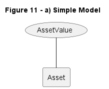
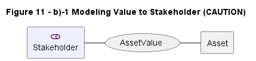
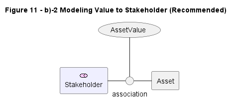
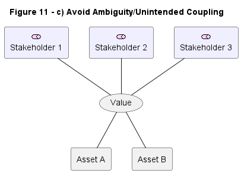

# 05 The Motivation Aspect

A quick table shows the ArchiMate notations matching SABSA attributes:

| SABSA | ArchiMate Notation|
| --- | --- |
| Value / Loss / Value Chain | Value |
| Business Attribute / Article / Mandate / Trust | Principle |
| Control Objective / Compliance Objective | Goal |
| Controls* / Exception | Requirement |
| Context of Requirements | Meaning |
| Risk / Impact / Threat / Vulnerability | Assessment |
| Constraint | Constraint |
| Standard / Regulation | Representation |

\* Control is unique in the Security Overlay in that it can extend any base type.

## 5.1 Value & Loss

The "What" column of the SABSA Architecture Matrix acknowledges the business value of assets.

**Business Value** may be expressed in several forms (financial, legal, brand, social, economic, health & safety) in combination or with others.

This evolution brings it closer to the ArchiMate Specification, which has no element to represent an abstract Asset but instead offers the ability to associate a **Value** element with any model element.

Models containing many Values will have following consideration for reflecting the associated Element name through adopting of a naming conversion:

| Figure 11 | Diagram | Source |
| --- | --- | --- |
| a) Simple model, shows the simple association of a Value with a generic eelment, thereby making it as an asset. |  | [11-a](./Figure11/Figure11_a.puml) |
| b1) Modeling Value to Stakeholder, this model needs CAUTION when a Value is appreciated by several Stakeholder or associated with multiple assets. |  | [11-b1](./Figure11/Figure11_b1.puml) |
| b2) Modeling Value to Stakeholder, this in-line (teritiary) relationship is better pattern and is recommended |  | [11-b2](./Figure11/Figure11_b2.puml) |
| c) Avoice this kind of Amibiguity/Unintended Coupling |  | [11-c](./Figure11/Figure11_c.puml) |

## 5.2 Value Chain

## 5.3 SABSA Business Attributes

| SABSA | ArchiMate |
| --- | --- |
| **Business Attributes** represent the essential qualities of the Stakeholders' ideal system, to be promoted, portected, and enhanced in the Target Architecture if the enterprise is to deliver its strategy. | **Principle** elements are defined as "an intended property of a system ... a general property that applies to any system in a certain context ... motivated by some goal or driver" |

## 5.4 Meaning

## 5.5 Impact, Threat, Vulnerability, and Risk

## 5.6 Controls: Objectives, Requirements, and Measures

## 5.7 Multi-Teired Security

## 5.8 Regulations and Standards

## 5.9 Articles, Mandates, and Compliance Objectives

## 5.10 Control Mechanisms

## 5.11 Trust

---

[<button type="button">«Chapter 04</button>](../04_Align_SABSA_and_ArchiMate_Framework/README.md) [<button type="button">Chapter 06»</button>](../06_Modeling_Contextual_Security_Architecture/README.md) [<button type="button">HOME</button>](../README.md)

---

Any comments, feel free to post to the [Discussion Board](https://github.com/yasenstar/ArchiMate_SABSA/discussions).