# 05 The Motivation Aspect

A quick table shows the ArchiMate notations matching SABSA attributes:

| SABSA | ArchiMate Notation|
| --- | --- |
| Value / Loss / Value Chain | Value |
| Business Attribute / Article / Mandate / Trust | Principle |
| Control Objective / Compliance Objective | Goal |
| Controls* / Exception | Requirement |
| Context of Requirements | Meaning |
| Risk / Impact / Threat / Vulnerability | Assessment |
| Constraint | Constraint |
| Standard / Regulation | Representation |

\* Control is unique in the Security Overlay in that it can extend any base type.

### Figure 10: Security Enhanced Motivation Metamodel

- Image: 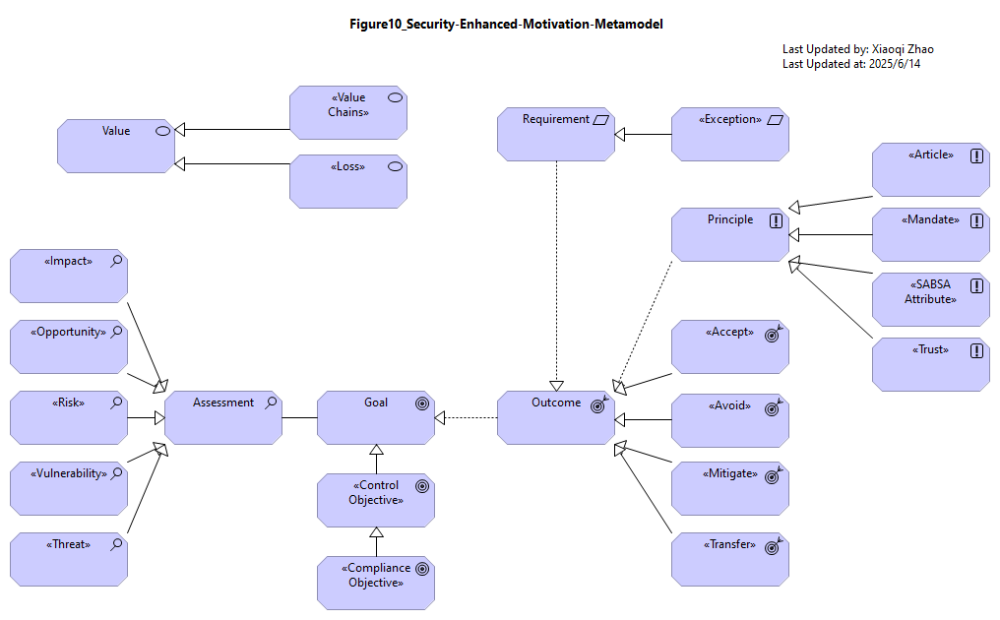
- Archi Model: [ArchiMate_SABSA_Figure10.archimate](./Figure10/ArchiMate_SABSA_Figure10.archimate)

## 5.1 Value & Loss

The "What" column of the SABSA Architecture Matrix acknowledges the business value of assets.

**Business Value** may be expressed in several forms (financial, legal, brand, social, economic, health & safety) in combination or with others.

This evolution brings it closer to the ArchiMate Specification, which has no element to represent an abstract Asset but instead offers the ability to associate a **Value** element with any model element.

### Figure 11: Modeling Assets using Value

Models containing many Values will have following consideration for reflecting the associated Element name through adopting of a naming conversion:

| Figure 11 | Diagram | Source |
| --- | --- | --- |
| a) Simple model, shows the simple association of a Value with a generic eelment, thereby making it as an asset. |  | [11-a](./Figure11/Figure11_a.puml) |
| b1) Modeling Value to Stakeholder, this model needs CAUTION when a Value is appreciated by several Stakeholder or associated with multiple assets. |  | [11-b1](./Figure11/Figure11_b1.puml) |
| b2) Modeling Value to Stakeholder, this in-line (teritiary) relationship is better pattern and is recommended |  | [11-b2](./Figure11/Figure11_b2.puml) |
| c) Avoice this kind of Amibiguity/Unintended Coupling |  | [11-c](./Figure11/Figure11_c.puml) |

For 11-b2, here is the updated code for diagramming, after checking with PlantUML team:

```bash
@startuml
title Figure 11 - b)-2 Modeling Value to Stakeholder (Recommended)

class Stakeholder <<motivation>>
class AssetValue <<motivation>>
class Asset <<element>>

hide <<motivation>> circle
hide <<element>> circle

hide <<motivation>> members
hide <<element>> members

Stakeholder - Asset
AssetValue .. (Stakeholder, Asset)

@enduml
```

Fullying using Class Diagram notations with the link to the link:


### Table 10: Proposed Value Property Overlay

Visualized Schema for Element Value / «Loss» is modeled in JSON format: [Value_Loss.json](./Table10/Value_Loss.json)

## 5.2 Value Chain

### Figure 12: Composition of Value Chain

The Security Overlay also specializes Value into «Value Chain», providing a specific profile for the Strategy elements, Capability and Value Stream.

Detail is to be discussed in [Chapter 6.1](../06_Modeling_Contextual_Security_Architecture/README.md#61-business-assets)

- The key measures of meta-processes are rooted in cost-accounting: production cost, sales prices, and margin.
- The organization seeks to identify which activities generate value and which are inefficient or uneconomic.
- The security perspective is concerned with enhancing and protecting the value of the value generators while containing the costs of the inefficient process.
- The ValueChain stereotype models the breakdown of costs and is, therefore, principally a financial measure.
- The Security Overlay can be used to map the composition of a Value Chain to any behavioral element in the Enterprise Architecture model.

- Image: 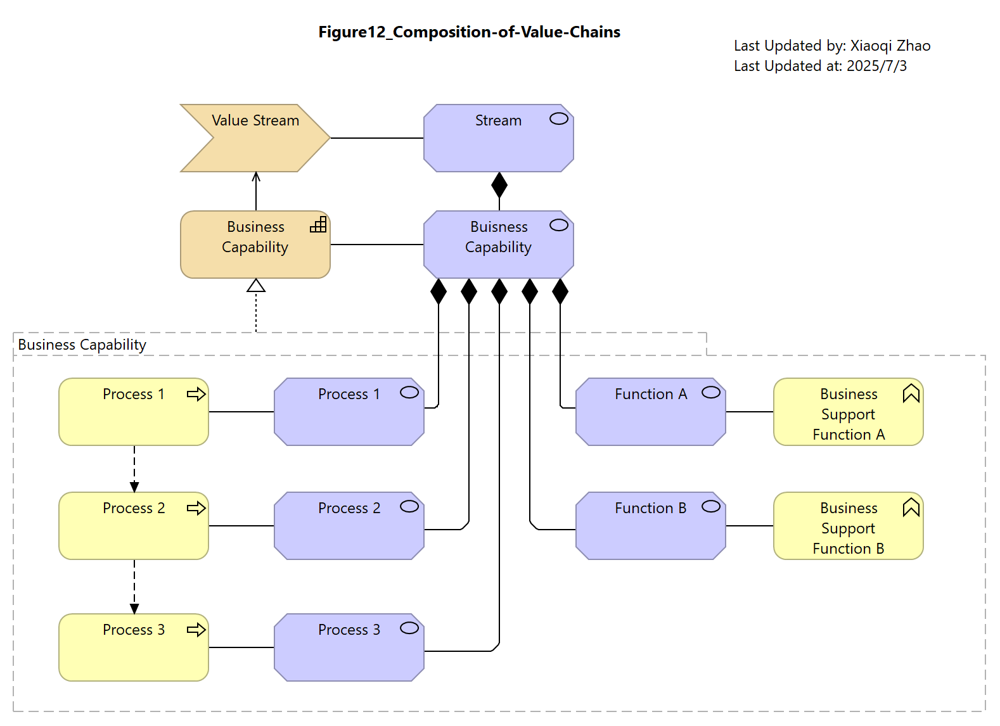
- Archi Model: [ArchiMate_SABSA_Figure12.archimate](./Figure12/ArchiMate_SABSA_Figure12.archimate)

### Table 11: Value Chain Properties

- The attributes proposed for the Value Chain profile enable the margin to be calculated as the sum of its constituent sub-chains.
- The ArchiMate Specification allows the Value elements to be decomposed into compositions and aggregations of the same type.
- Composition seems the safer option here because, unlike aggregation, it should prevent cost accounting figures from being counted multiple times.

Check [here](./Table11/Value_Chain.json) for the JSON format Schema on Value Chain properties.

## 5.3 SABSA Business Attributes

### Figure 13: SABSA Business Attributes Represented in the ArchiMate Language

| SABSA | ArchiMate |
| --- | --- |
| **Business Attributes** represent the essential qualities of the Stakeholders' ideal system, to be promoted, protected, and enhanced in the Target Architecture if the enterprise is to deliver its strategy. | **Principle** elements are defined as "an intended property of a system ... a general property that applies to any system in a certain context ... motivated by some goal or driver" |

Memo:

1. Business Attribute is modelded as a specialization of `Principle`, distinguishing it from convertional uses (such as "Cloud First") and enabling it to define a distinct security profile
2. The taxonomy is structured as an abstract base _Business Attribute_, specialized into domains using `Groupings`
    - Domains act as namespaces that support the construction of qualified names enabling Attributes to be overloaded with an appropriate definition and metrics for different contexts
    - Grouped attributes promote consistency and correctness in modeling; e.g., Stakeholders with legal concerns should only be offerted `associations` with Legal and Regulatory attributes
    - It enables Attributes with the same non-qualified name to appear on the same diagram

[Here](https://api.pageplace.de/preview/DT0400.9781482280920_A25782338/preview-9781482280920_A25782338.pdf), you can access the free part of this book - Enterprise Security Architecture: A Business-Driven Approach, I put [downloaded PDF](../Docs/Enterprise-Security-Architecture-Business-Driven-Approach_preview-9781482280920_A25782338.pdf) for your convenience.

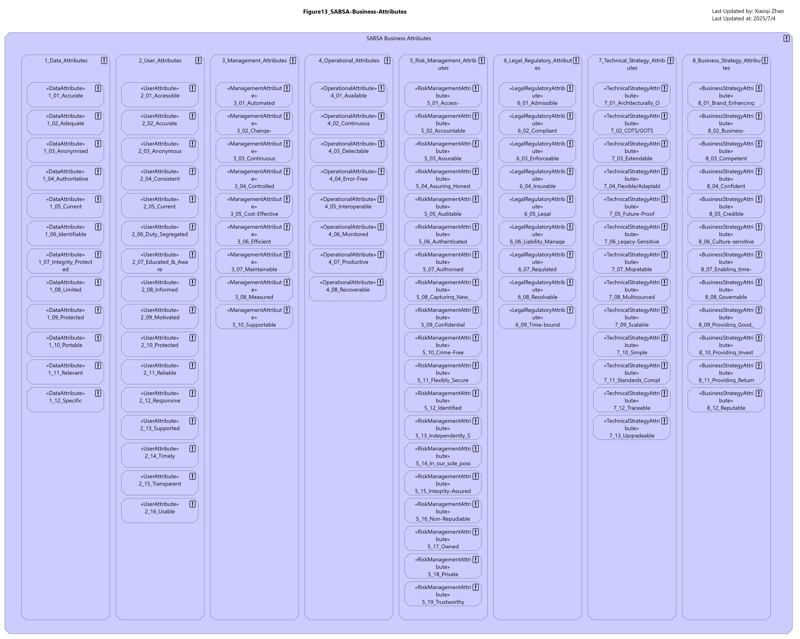

Snapshot ArchiMate Model: [ArchiMate_SABSA_Figure13.archimate](./Figure13/ArchiMate_SABSA_Figure13.archimate)

### Table 12: SABSA Attribute Properties

[«SABSA Attribute» JSON Schema](./Table12/«SABSA_Attribute».json)

### 5.3.1 Structural Placement of Business Attributes

#### Figure 14: Hierarchy of Abstraction

Abstraction level from top to bottom:

1. Principle: a fundamental, primary, or general law or truth from which others are derived.
2. Policy
3. Control Objective
4. Control Requirement (and Constraints)

#### Figure 15: The SWIFT/COSO Model

- 3 Objectives
- 8 Principles
- 27 Controls

The original 20024 COSO Enterprise Risk Management framework (https://www.coso.org/enterprise-risk-management) placed "Principles" between "Objectives" and "Controls".

#### Figure 16: Principle in the ArchiMate Motivation Hierarchy

The ArchiMate Specification follows the COSO paradigm, putting `Principles` to be used as maxims to guide Designers toward `Outcomes` and `Goals`.

Snapshot ArchiModel File: [Model-Figure16](./Figure16/ArchiMate_SABSA_Figure16.archimate)

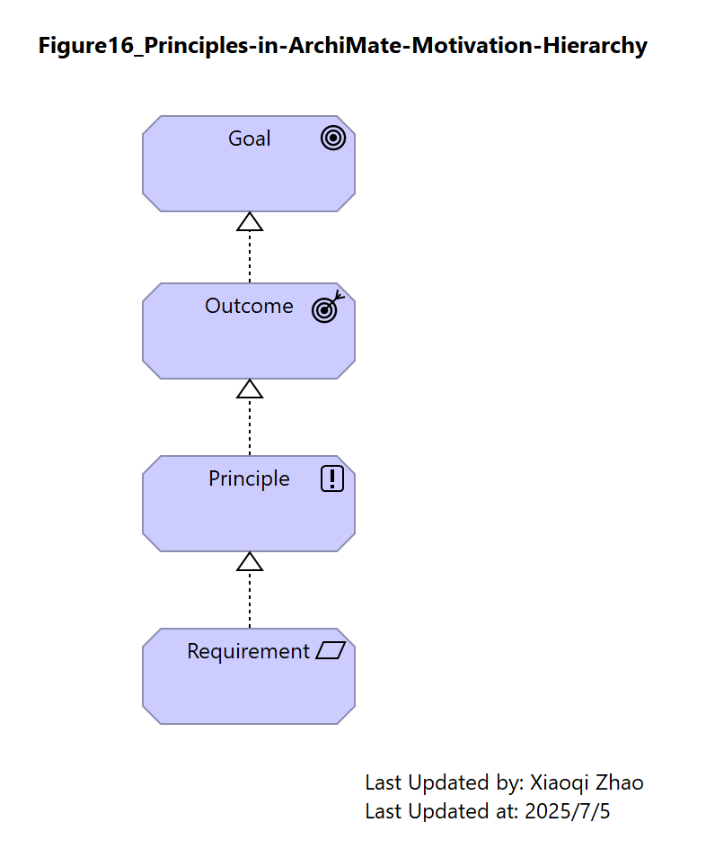

#### Figure 17: Highlighting the Control Hierarchy Mismatch (i)

| What SABSA Would Like to Express | What ArchiMate Specification Supports |
| --- | --- |
| Attribute (_Confidentiality_) as being satisfied by specific Goals ("_Protections of Data at Rest_" and "_Protection of Data in Transit_") at various points in the model. These are to be achieved by distinct, verifiable Requirements ("_Access Control_" and "_Channel Encryption_"), respectively. | Place _Confidentiality_ in the center of the structure and, by doing so, forces the realization paths to merge. The resulting model suggests "_Protection of Data at Rest_" might be realized through "_Channel Encryption_" and "_Protection of Data in Transit_" through "_Access Control_". |
| 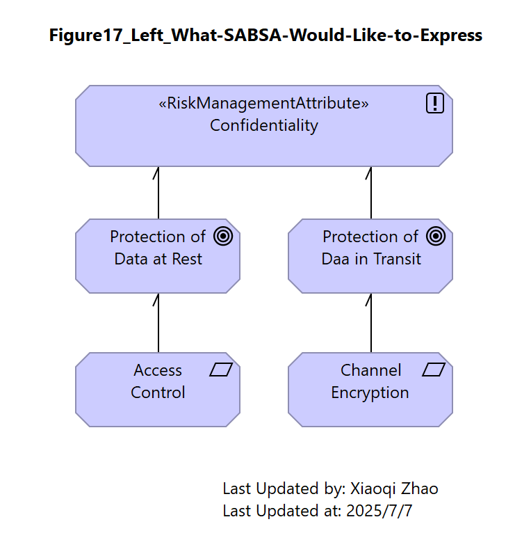 | 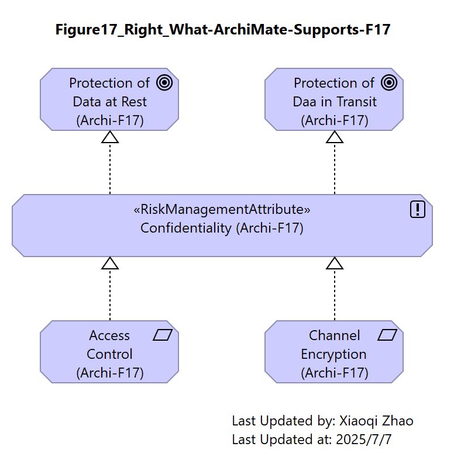 |

The result is both unintentional and incorrect. It is also difficult to disentangle because, even if the structures are _drawn_ as distinct views, they remain merged in the underlying model, causing a problem for automated analysis which sees both paths as legitimate and is consequently unable to resolve the modeler's intent.

Snapshot ArchiModel File: [Model-Figure17](./Figure17/ArchiMate_SABSA_Figure17.archimate)

#### Figure 18: Highlighting the Control Hierarchy Mismatch (ii)

A workaround might be parallel stacks (Below right), each with its own instance of "_Confidentiality_".

| What SABSA Would Like to Express | What ArchiMate Specification Supports |
| --- | --- |
|  | Note these need to be distinct elements (with distinct names) to avoid the entanglement of the previous proposal. |
|  | 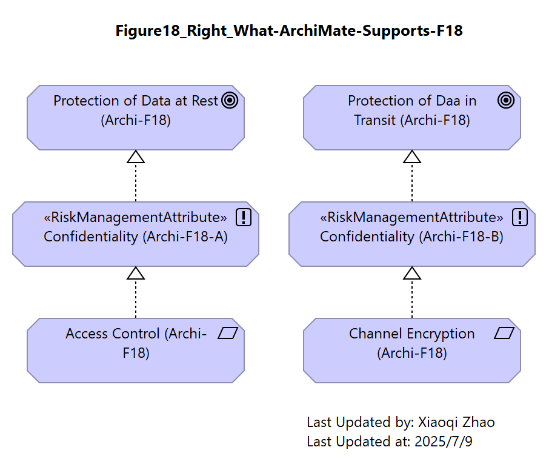 |

Although this approach achieves the required segregation and is entirely within the specification, creating distinct _Confidentiality_ elements for each stack is inelegant.

Conceptually, Attributes are singletons, so any duplication creates redundancy and maintenance issues.

If a good model is meant to reflect reality, this is a poor style: the concept of different "_flavors_" of confidentiality is not a natural way to model the real world.

Snapshot ArchiModel File: [Model-Figure18](./Figure18/ArchiMate_SABSA_Figure18.archimate)

#### Figure 19: Achieving the Desired Hierarchy

This is a better solution eschews the standard structure, but remains legal and reflects the original intent.

| What SABSA Would Like to Express | What ArchiMate Specification Supports |
| --- | --- |
|  | Via a convertion in which SABSA Attributes are only ever _influence_ by Control Objectives, the desired structure can be achieved within legal grammer. |
|  | 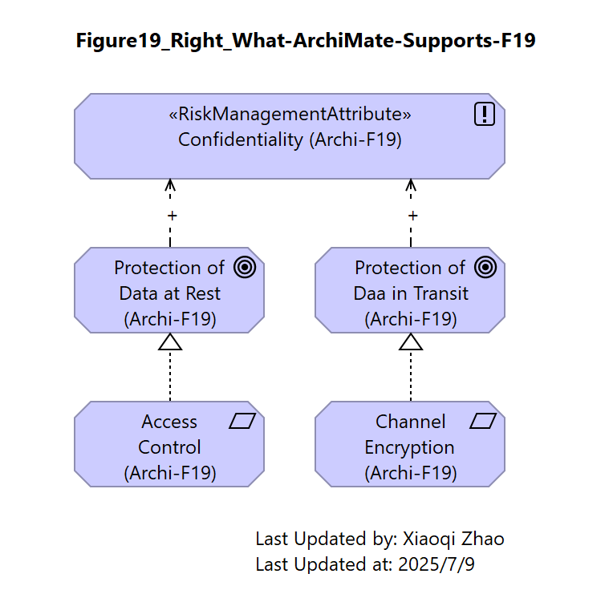 |

This choice aligns with the ArchiMate definition of influence as "_a traceable motivational path_", where the "_motivation element is achieved to a certain degree_". That is to say, SABSA Attributes are _strengthened_ by the achievement of Control Objectives rather than attained absolutely.

Snapshot ArchiModel File: [Model-Figure19](./Figure19/ArchiMate_SABSA_Figure19.archimate)

### 5.3.2 Traceability of Business Attributes

This is another essential requirement of SABSA Attribute modeling, which is the ability to trace their refinement through the architectural layers, also implemented using influence relationships, see below Figure 20.

#### Figure 20: Attribute Traceability Across Layers

Because SABSA Attributes are global singletons, reuse within a model runs the risk of unintended coupling.

Snapshot ArchiModel File: [Model-Figure20](./Figure19/ArchiMate_SABSA_Figure20.archimate)

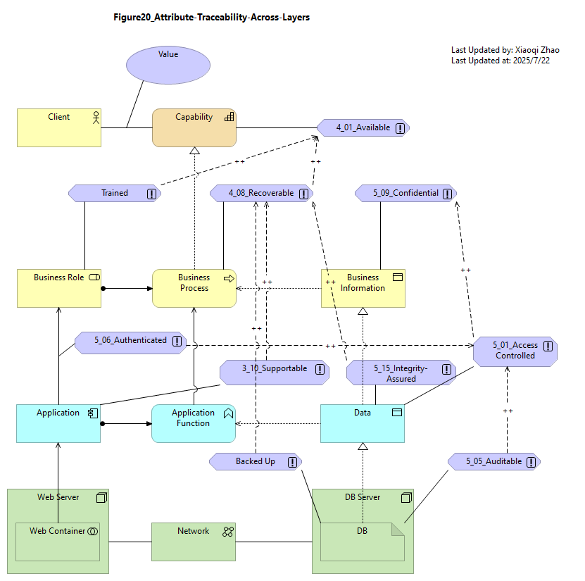

## 5.4 Meaning

The ArchiMate `Meaning` element is not extended by the Security Overlay other than by the addition of an optional profile.

As described in the previous sections, the SABSA Attribute taxonomy incorporates a catalog of elements, definitions and hard/soft metrics via the security profile.

Because Business Attributes are modeled as singletons, any definition and metric, modeled within the profile, will apply to everything that the Attribute touches; i.e., in every context where the Attribute is referenced.

### Figure 21: Applying Attribute Metrics to Multiple Controls

This causes problems where an Attribute is applied to multiple points in the same model. Consider, for example, whether there is a single _Confidentiality_ Attribute enhanced by the two Control Objectives and four Controls of Figure 21. How can be express context-sensitive definition and metrics?

Figure 21: Applying Attribute Metrics to Multiple Controls (Snapshot Model: [Model-Figure21](./Figure21/ArchiMate_SABSA_Figure21.archimate))

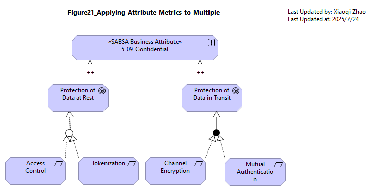

### Figure 22: Use of Meaning of Externalize Context-Sensitive Metrics

The Security Overlay recommends the use of **Meaning** elements to re-interpret the Attribute for each context.

Figure 22 shows how the `meaning` of _Confidentiality_ (i.e. definition and metrics) can be externalized and then adapted to _Tokenization_, _Access Control_, and other requirements using Meaning elements. (Snapshot Model: [Model-Figure22](./Figure22/ArchiMate_SABSA_Figure22.archimate))

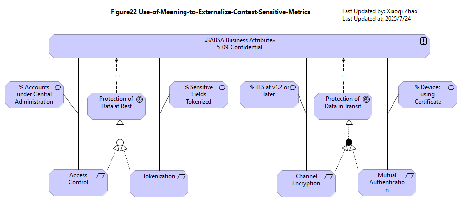

## 5.5 Impact, Threat, Vulnerability, and Risk

Guided by the ArchiMate Specification, impacts, threats, vulnerabilities, and risks are modeled as stereotyped `__Assessment__` elements, providing a good semantic fit that reflects the subjective uncertainty inherent in assessing these unknowns.

### Table 13: Risk Element Properties

| Elment | Schema File | Schema Visualization |
| --- | --- | --- |
| «Risk» | [Risk JSON](./Table13/«Risk».json) | 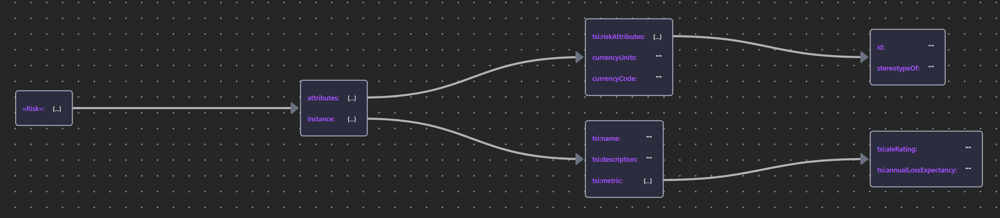 |
| «Impact» | [Impact JSON](./Table13/«Impact».json) | 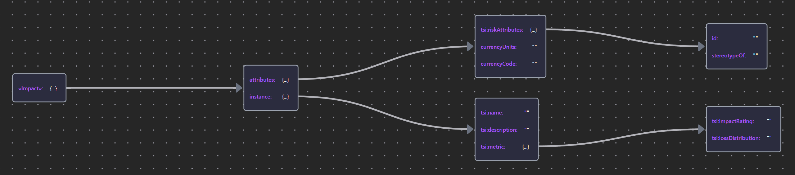 |
| «Threat» | [Threat JSON](./Table13/«Threat».json) | 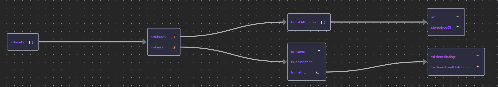 |
| «Vulnerability» | [Vulnerability JSON](./Table13/«Vulnerability».json) | 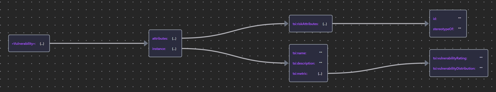 |

## 5.6 Controls: Objectives, Requirements, and Measures

In ArchiMate Specification, `Goal` is specialized as Control Objective, and `Requirement` is specialized as Control Measure.

To cope with the semantic question, the Security Overlay retains the «Control Objective» stereotype of `Goal`, retains `Requirement` for security requirements without specialization, and introduces a new «Control» stereotype to represent the control mechanism.

### Figure 23: Expressing Composite Requirements

Modeling a Control Objective realized by a control mechanism via a `requirement` is a good semantic fit. In practice, though, a single `Requirement` is often insufficient.

Snapshot Model: [Model-Figure23](./Figure23/ArchiMate_SABSA_Figure23.archimate)

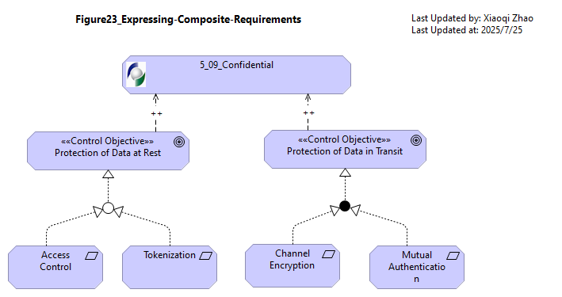

### Figure 24: Example of a Control Pattern

Sometimes a requirement is realized through a combination of elements and relationships, acting in concert. In such cases, the realization of the requirement can be expressed as a pattern using a grouping marked as a control stereotype.

Snapshot Model: [Model-Figure24](./Figure24/ArchiMate_SABSA_Figure24.archimate)

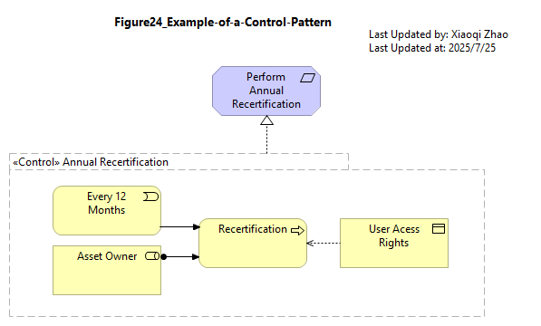

## 5.7 Multi-Teired Security

SABSA's Conceptual/Process cell discusses the combination and layering of Controls for "Defense-in-Depth" or "End-to-End Protection".

The Blue Book (Enterprise Security Architecture - A Business-Driven Approach, [preview link](https://api.pageplace.de/preview/DT0400.9781482280920_A25782338/preview-9781482280920_A25782338.pdf)) describes a 4-tier model:
- Prevent
- Contain
- Detect & Notification, and
- Recovery & Restoration.

The [NIST™ Cybersecurity Framework](https://www.nist.gov/cyberframework) (local download link: [NIST CyberFramework 2.0](../Docs/NIST.CSWP.29.pdf)) identifies six control functions:
- Govern
- Identify
- Protect
- Detect
- Respond, and
- Recover

### Table 14: Control Element Properties

The Security Overlay:
- adds the category "Deter" to cover sanctions expressed in Policies & Contractual clauses. 
- the identify set (including Asset Management, Business Environment, Governance, Risk Assessment, and Risk Management Strategy) are modeled in the 2nd and tertiary (3rd, 第三) architectures rather than the primary, run-time architecture.
- the profile for the Control elements has been derived from analysis and use of several commonly used control frameworks.

| Elment | Schema File | Schema Visualization |
| --- | --- | --- |
| Control Element | [ControlElement](./Table14/ControlElements.json) | 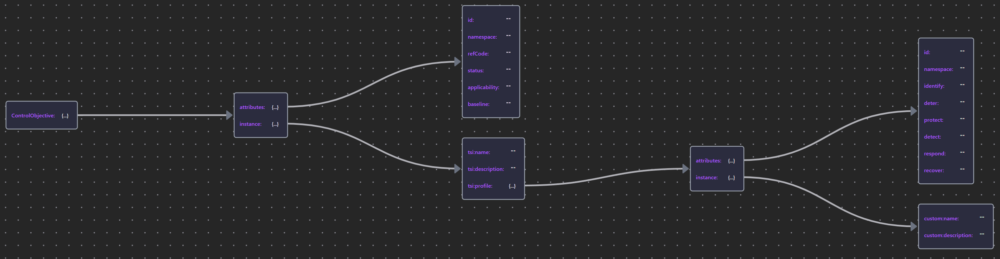 |

### Figure 25: Example of Multi-Tiered Security

In this Figure 25, profile attributes are declared in the Control Objectives element to define its protection requirement and in each Requirement element to describe its protection capability.

### Compliance

## 5.8 Regulations and Standards

### Figure 25: The Structure of Standards and Regulations

### Table 15: Standard and Regulation Properties

## 5.9 Articles, Mandates, and Compliance Objectives

### Figure 27: Articles and Compliance Objectives

### Table 16: Compliance Conceptual Element Properties

## 5.10 Control Mechanisms

### Figure 28: Use Cases and Iconography for Control

### Table 17: Control Properties

## 5.11 Trust

### Table 18: Trust Profile

---

[<button type="button">«Chapter 04</button>](../04_Align_SABSA_and_ArchiMate_Framework/README.md) [<button type="button">Chapter 06»</button>](../06_Modeling_Contextual_Security_Architecture/README.md) [<button type="button">HOME</button>](../README.md)

---

Any comments, feel free to post to the [Discussion Board](https://github.com/yasenstar/ArchiMate_SABSA/discussions).