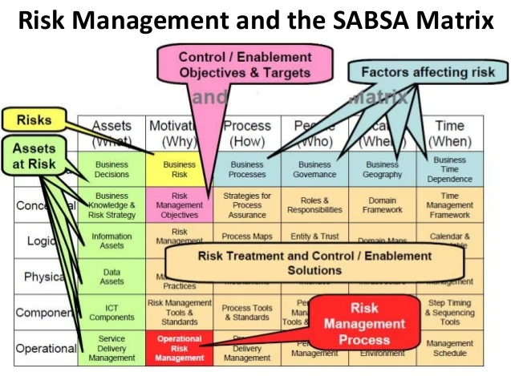
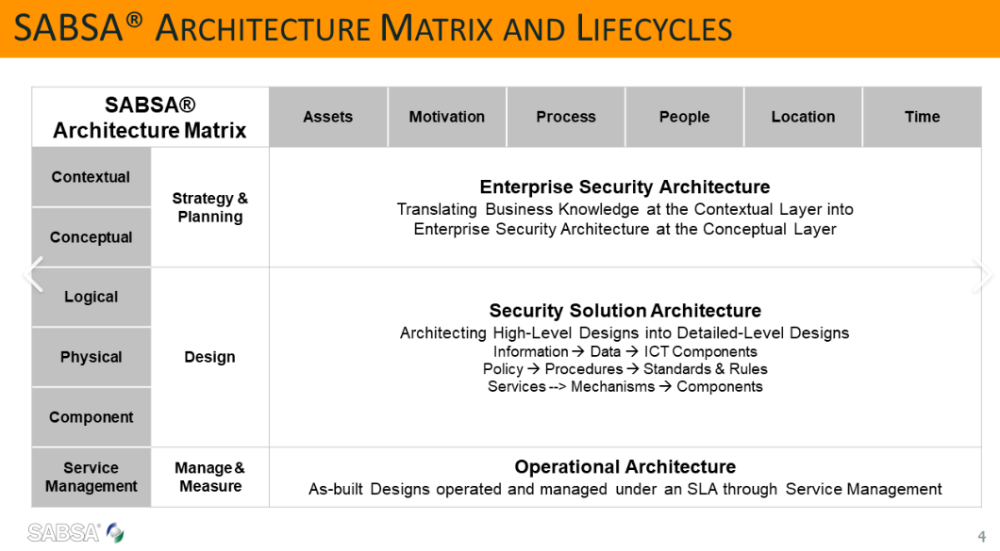

# 06 Modeling the Contextual Security Architecture

The SABSA Matrix illustration:

_Sourse: https://www.slideshare.net/MVeeraragaloo/sabsa-implementationpart-viver10_

another Matrix view with Lifecycle context:

_Source: https://www.alctraining.com.sg/course/sabsa-foundation/_

---

[<button type="button">«Chapter 05</button>](../05_Motivation_Aspect/README.md) [<button type="button">Chapter 07»</button>](../07_Modeling_Conceptual_Security_Architecture/README.md) [<button type="button">HOME</button>](../README.md)
