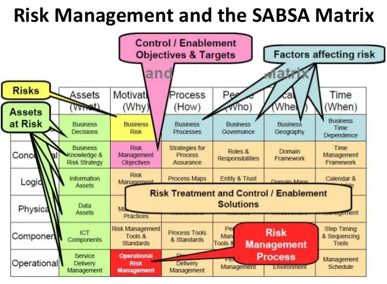
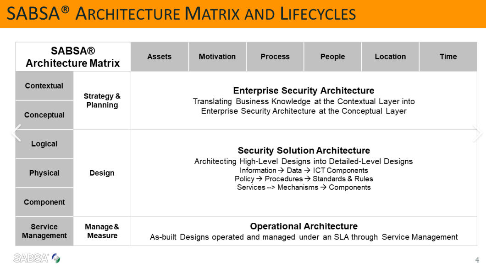
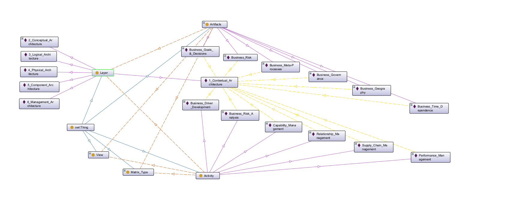

# 06 Modeling the Contextual Security Architecture

## 6.0 Overview

The SABSA Matrix illustration:

_Sourse: https://www.slideshare.net/MVeeraragaloo/sabsa-implementationpart-viver10_

another Matrix view with Lifecycle context:

_Source: https://www.alctraining.com.sg/course/sabsa-foundation/_

### Table 19: SABSA Contextual Architecture

Using Protégé tool, the snapshot ontology model is here: [sabsa_matrices_2018_table19.rdf](./Table19/sabsa_matrices_2018_Table19.rdf)

Putting SABSA Contextual Architecture layer in the middle, below is the screenshot from onto-graph, base on Table19:

### Figure 29: Developing and Maintaining the Contextual Security Architecture

Tha above outline enables us to visualize the set of processes and activities necessary to create and maintain an Architectural Description of the Contextual Architecture, expressed in ArchiMate Specification in below Figure 29.

### Table 20: Contextual Elements

## 6.1 Business Assets

### 6.1.1 Capability and Value Stream

- `Value Stream` is a behavioral element within ArchiMate's Strategy Layer
- A key principle of a `Value Stream` is that its value is always defined from the perspective of the Stakeholder, the consumer of the product, service, or deliverable, and not on its intrinsic value; i.e., the cost of production
- The value of `Value Stream` can be modeled in the ArchiMate language using the `Value` element.

### 6.1.2 Business Object

- `Business Object` represent Information Assets.

### 6.1.3 Business Service, Interface, and Service Level Agreements

- Business Layer services need a distinct property set when they are offered through human interfaces.
- SLA is using `Contract` element, a bespoke `Requirement`/`Constraint` may also be used where a simple property is insufficient.
- `Business Service`s may be offered via multiple interfaces (`Business Interface`)

## 6.2 Business Risk

- Risk, threats, vulnerabilities, and opportunities can be modeled at the Business and Strategy level using the orthodox ArchiMate approach discussed in [Section 4.3](../04_Align_SABSA_and_ArchiMate_Framework/README.md#43-risk--security-modeling-in-the-archimet-specification)
- The Security Overlay adds stereotyps(«») of motivational layer elements for this purpose, introduced in [Section 5.5](../05_Motivation_Aspect/README.md#55-impact-threat-vulnerability-and-risk)

## 6.3 Business Process/Function/Interaction

- `Business Process` are often categorized in terms of their criticality to core business mission, capabilities, and value chains.
- Behavioral elements may also be deemed sensitive due to the way they operate on information.

## 6.4 Business Roles and Actors

In ArchiMate Specification, `Actors` represent human or organizational entities that can be assigned to `Roles` that describe:

- The extent of their responsibilities with respect to a given `business process`
- Their use of `business and application services`

### 6.4.1 Governance

Governance runs like a seam through the People column of the SABSA Matrix.

RACI presents an interesting design consideration in the ArchiMate Specification. Applying "Subject-Verb-Object" syntax to RACI requires considering what the "Process of Being Accounatable" means and what it would look like.

### 6.4.2 Threat Actors

Seurity models, by definition, have to consider the potential abuse of a system through malicious intent.

Three possible asys of modeling Threats are:

1. As an `Actor`: A constituency that is known to pose an accidental or intentional threat
2. As a `Role`: Representing a malicious intent, directed against the target system
3. As an action (a behavior or event) that occurs by error, omission, or intent

## 6.5 Business Geography

- Business geography is easily modeled using the ArchiMate `Location` element unadorned (朴素).

## 6.6 Business Time Dependencies

- The SABSA Time cell is concerned with the delivery schedule of `goals` and responding to `events`.
- Target dates in the ArchiMate Specification are intrinsic to the definition of a `Goal` (a desired state to be reached by a defined point in time) and can be make explicit through `Implementation and Migration` views.
- The `Business Event` element can be used unadorned.

---

[<button type="button">«Chapter 05</button>](../05_Motivation_Aspect/README.md) [<button type="button">Chapter 07»</button>](../07_Modeling_Conceptual_Security_Architecture/README.md) [<button type="button">HOME</button>](../README.md)

---

Any comments, feel free to post to the [Discussion Board](https://github.com/yasenstar/ArchiMate_SABSA/discussions).