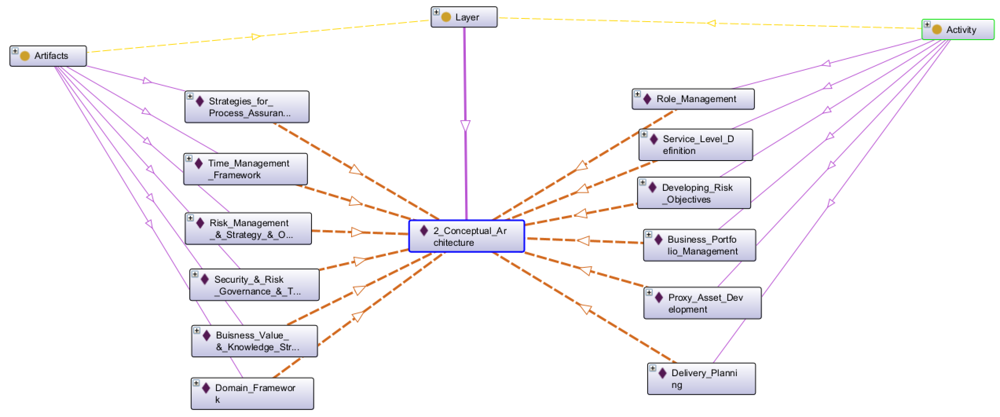
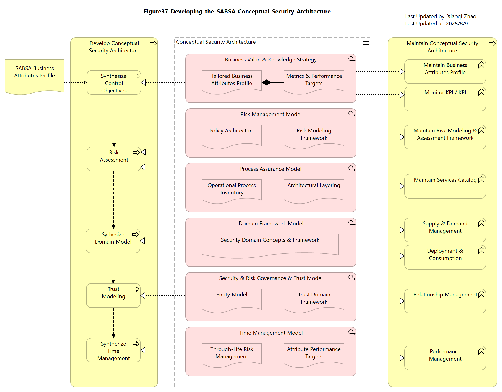
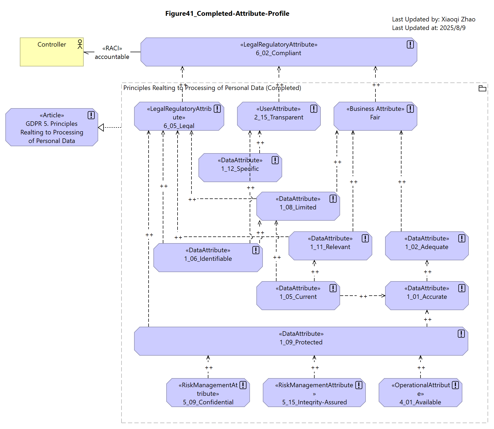
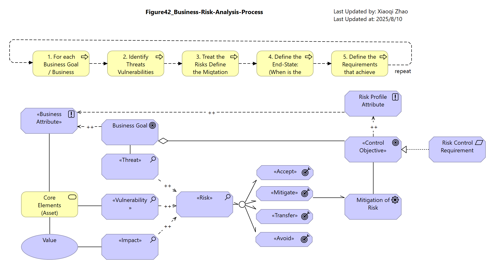

# 07 Modeling the Conceptual Security Architecture

- [07 Modeling the Conceptual Security Architecture](#07-modeling-the-conceptual-security-architecture)
  - [7.0 Overview](#70-overview)
    - [Table 28: SABSA Conceptual Security Architecture](#table-28-sabsa-conceptual-security-architecture)
    - [Figure 37: Developing the SABSA Conceptual Security Architecture](#figure-37-developing-the-sabsa-conceptual-security-architecture)
  - [7.1 Attribute Profiling](#71-attribute-profiling)
    - [Figure 38: Attribute Profiling (i)](#figure-38-attribute-profiling-i)
    - [Figure 39: Attribute Profiling (ii)](#figure-39-attribute-profiling-ii)
    - [Figure 40: Attribute Profiling (iii)](#figure-40-attribute-profiling-iii)
    - [Figure 41: Completed Attribute Profile](#figure-41-completed-attribute-profile)
  - [7.2 Risk Management \& Strategy](#72-risk-management--strategy)
    - [7.2.1 Risk Management](#721-risk-management)
      - [Figure 42: Business Risk Analysis Process](#figure-42-business-risk-analysis-process)
    - [7.2.2 Policy Architecture](#722-policy-architecture)
      - [Figure 43: Compliance Metamodel](#figure-43-compliance-metamodel)
      - [Figure 44: An Example Compliance Model - NIST 800-53](#figure-44-an-example-compliance-model---nist-800-53)
    - [7.2.3 Multi-Regulatory Compliance](#723-multi-regulatory-compliance)
      - [Figure 45: Control Consolidation](#figure-45-control-consolidation)
      - [Figure 46: Possible Duplicate Objectives, Coupled Through Attribute Profile](#figure-46-possible-duplicate-objectives-coupled-through-attribute-profile)
  - [7.3 Conceptual Security Services](#73-conceptual-security-services)
    - [Figure 47; Security Services in the Conceptual Layer](#figure-47-security-services-in-the-conceptual-layer)
  - [7.4 Identity and Trust](#74-identity-and-trust)
    - [7.4.1 Identity and Access Rights](#741-identity-and-access-rights)
      - [Figure 48: What is the Security Overlay Would Like to Express](#figure-48-what-is-the-security-overlay-would-like-to-express)
      - [Figure 49: What the ArchiMate Specification Supports](#figure-49-what-the-archimate-specification-supports)
      - [Table 29: Elements used in Logical Access Management](#table-29-elements-used-in-logical-access-management)
    - [7.4.2 Roles and Responsibilities](#742-roles-and-responsibilities)
      - [Figure 50: Modeling Identity and Role Concepts](#figure-50-modeling-identity-and-role-concepts)
    - [7.4.3 Trust](#743-trust)
      - [Figure 51: Common Examples of Signals Crossing Domain Boundaries](#figure-51-common-examples-of-signals-crossing-domain-boundaries)
      - [Figure 52; Simple Trust Relationships using Flow](#figure-52-simple-trust-relationships-using-flow)
      - [Figure 53; Trust Attributes Associated with Inter-Domain Signals](#figure-53-trust-attributes-associated-with-inter-domain-signals)
      - [Table 30: Elements and Relationships used in Trust Modeling](#table-30-elements-and-relationships-used-in-trust-modeling)
  - [7.5 Domain Framework Model](#75-domain-framework-model)
    - [Table 31: Security Domain Mapping](#table-31-security-domain-mapping)
  - [7.6 Security Events](#76-security-events)
    - [Table 32; Security Events](#table-32-security-events)

## 7.0 Overview

### Table 28: SABSA Conceptual Security Architecture

Snapshot Protege RDF File: [sabsa_matrices_2018_ch07.rdf](./sabsa_matrices_2018_ch07.rdf)

You may find the detail descriptions per Artifacts and Avtivity, the ontology / matrix outline enables the visualizing the set of processes and activities necessary to create and maintain an Architecture Descroption of the Conceptual Architecture.

### Figure 37: Developing the SABSA Conceptual Security Architecture

Although the Conceptual layer has no ArchiMate equivalent, many of the asset (What) and motivation (Why) concepts (attribute profiles, metrics, risk, compliance, control objectives, and layering, etc.) have already been discussed as stereotypes of Motivation elements (see [Chapter 5](../05_Motivation_Aspect/README.md))

Snapshot ArchiMate Model: [Figure 37: Developing SABSA Conceptual Security Architecture](./Figure37/ArchiMate_SABSA_Figure37.archimate)

## 7.1 Attribute Profiling

Key points for presenting SABSA Attributes in ArchiMate language:

- SABSA Attributes are at the apex of the `motivation` pyramid - more abstract than Control Objectives
- SABSA Attributes are global atomic singletons: existing at most once in the model and never appearing, even as copies, more than once in any ArchiMate diagram
- In models, SABSA Attribute profiles are constructed using `influence relationships` to form tree structures that broadly follow the layered architecture
- Each SABSA Attribute may influence/be influenced by zero or more other Attributes, but the tree structure must hold: these `influence relationships` should not be directed downwards from higher to lower layers, so circular paths should not occur in the structure
- SABSA Attributes should be associated to the elements to which they apply, and must be influenced by another `Motivation element`: typically, another Attribute and ultimately by a `Goal` or `Requirement`

### Figure 38: Attribute Profiling (i)

Following section describes the creation of such a profile through a worked example from [GDPR Article 5](https://gdpr-info.eu/art-5-gdpr/), which sets out the principles relating to the processing of personal data.

Article 5 clause (a) states:

"Personal data shall be (a) processed __lawfully__, __fairly__ and in a __transparent__ manner in relation to the data subject ("lawfulness, fairness, and transparency")."

Below Figure 38 shows the Attribute Profiling (i):

.png)

Snapshot ArchiMate Model: [Figure 38: Attribute Profiling (i)](./Figure38/ArchiMate_SABSA_Figure38.archimate)

### Figure 39: Attribute Profiling (ii)

Article 5 clause (b) states:

"(b) collected for __specified__, __explicit__ and __legitimate__ purposes and not further processed in a manner that is incompatible with those purposes; further processing for archiving purposes in the public interest, scientific or historical research purposes or statistical purposes shall, in accordance with Article 89(1), not be considered to be incompatible with the initial purposes (‘purpose limitation’);"

.png)

Snapshot ArchiMate Model: [Figure 39: Attribute Profiling (ii)](./Figure39/ArchiMate_SABSA_Figure39.archimate)

### Figure 40: Attribute Profiling (iii)

Article 5 clause (c) & (d) states:

"(c) __adequate__, __relevant__ and __limited__ to what is necessary in relation to the purposes for which they are processed (‘data minimisation’);"

"(d) __accurate__ and, where necessary, __kept up to date__; every reasonable step must be taken to ensure that personal data that are inaccurate, having regard to the purposes for which they are processed, are erased or rectified without delay (‘accuracy’);"

.png)

Snapshot ArchiMate Model: [Figure 40: Attribute Profiling (iii)](./Figure40/ArchiMate_SABSA_Figure40.archimate)

### Figure 41: Completed Attribute Profile

Article 5 clause (e) & (f) states:

"(e) kept in a form which permits __identification__ of data subjects for no longer than is necessary for the purposes for which the personal data are processed; personal data may be stored for longer periods insofar as the personal data will be processed solely for archiving purposes in the public interest, scientific or historical research purposes or statistical purposes in accordance with Article 89(1) subject to implementation of the appropriate technical and organisational measures required by this Regulation in order to safeguard the rights and freedoms of the data subject (‘storage limitation’);"

"(f) processed in a manner that ensures appropriate security of the personal data, including __protection__ against unauthorised or unlawful processing and against __accidental loss__, __destruction or damage__, using appropriate technical or organisational measures (‘__integrity__ and __confidentiality__’)."

"2. The controller shall be __responsible__ for, and be able to demonstrate compliance with, paragraph 1 (‘accountability’)."

Snapshot ArchiMate Model: [Figure 41: Completed Attribute Profile](./Figure41/ArchiMate_SABSA_Figure41.archimate)

## 7.2 Risk Management & Strategy

Risk and its constituent factors (threat, vulnerability and impact) are modeled as stereotypes of `Assessment` (adhering to the guidance in [Section 4.3](../04_Align_SABSA_and_ArchiMate_Framework/README.md#43-risk--security-modeling-in-the-archimet-specification) and [Section 5.5](../05_Motivation_Aspect/README.md#55-impact-threat-vulnerability-and-risk))

The Security Overlay provides high-level representations of these concepts that can be adapted to suit an organization's preferred risk methodology. The schema for these elements has already been presented in [Table 13: Risk Element Properties](../05_Motivation_Aspect/README.md#table-13-risk-element-properties)

### 7.2.1 Risk Management

#### Figure 42: Business Risk Analysis Process

The `Motivation` apsect of the SABSA Matrix also addresses the process of risk management. Recalling the discussion of architectural planes in [Section 4.2](../04_Align_SABSA_and_ArchiMate_Framework/README.md#42-an-overview-of-the-task), a risk analysis process would be modeled in the 2nd architecture (Management Processes) and look something like that shown in below Figure 42:

Snapshot ArchiMate Model: [Figure 42: Business Risk Analysis Process](./Figure42/ArchiMate_SABSA_Figure42.archimate)

### 7.2.2 Policy Architecture

The Policy Architecture is a framework of codified statements of regulatory compliance controls or those documented in the organization's policies and standards.

As discussed in [Section 5.8](../05_Motivation_Aspect/README.md#58-regulations-and-standards)

#### Figure 43: Compliance Metamodel

#### Figure 44: An Example Compliance Model - NIST 800-53

### 7.2.3 Multi-Regulatory Compliance

#### Figure 45: Control Consolidation

#### Figure 46: Possible Duplicate Objectives, Coupled Through Attribute Profile

## 7.3 Conceptual Security Services

### Figure 47; Security Services in the Conceptual Layer

## 7.4 Identity and Trust

### 7.4.1 Identity and Access Rights

#### Figure 48: What is the Security Overlay Would Like to Express

#### Figure 49: What the ArchiMate Specification Supports

#### Table 29: Elements used in Logical Access Management

### 7.4.2 Roles and Responsibilities

#### Figure 50: Modeling Identity and Role Concepts

### 7.4.3 Trust

#### Figure 51: Common Examples of Signals Crossing Domain Boundaries

#### Figure 52; Simple Trust Relationships using Flow

#### Figure 53; Trust Attributes Associated with Inter-Domain Signals

#### Table 30: Elements and Relationships used in Trust Modeling

## 7.5 Domain Framework Model

### Table 31: Security Domain Mapping

## 7.6 Security Events

### Table 32; Security Events

---

[<button type="button">«Chapter 06</button>](../06_Modeling_Contextual_Security_Architecture/README.md) [<button type="button">Chapter 08»</button>](../08_Modeling_Logical_Security_Architecture/README.md) [<button type="button">HOME</button>](../README.md)

---

Any comments, feel free to post to the [Discussion Board](https://github.com/yasenstar/ArchiMate_SABSA/discussions).