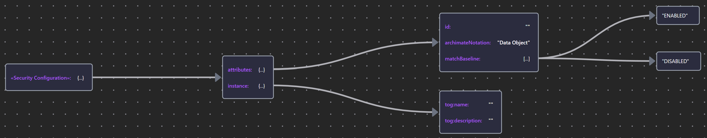
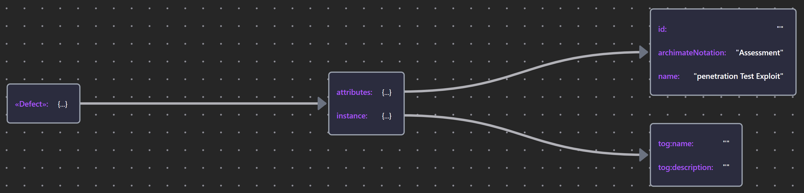
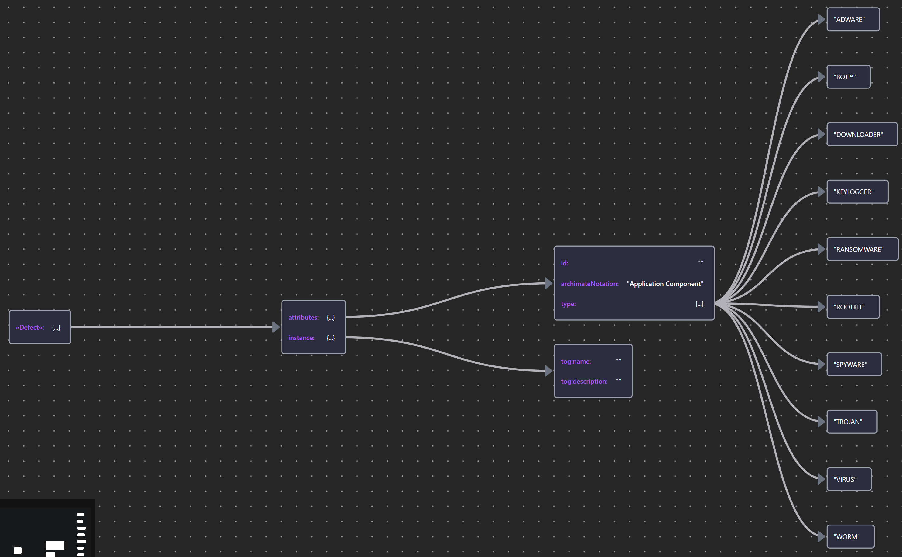
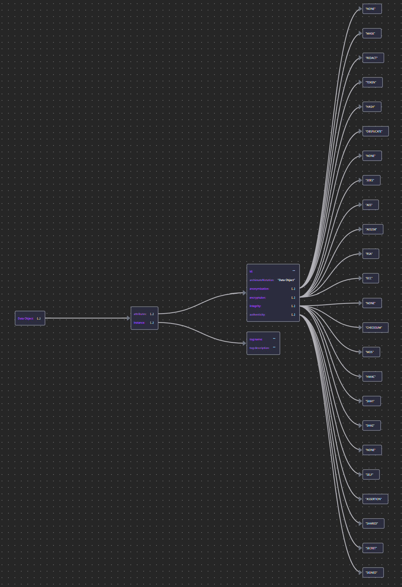
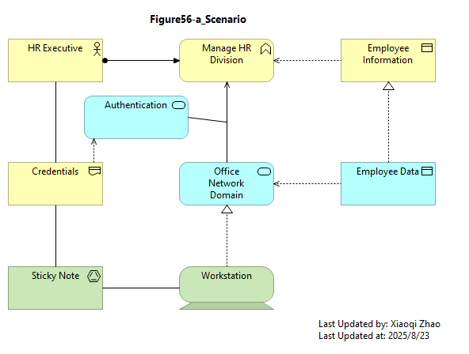
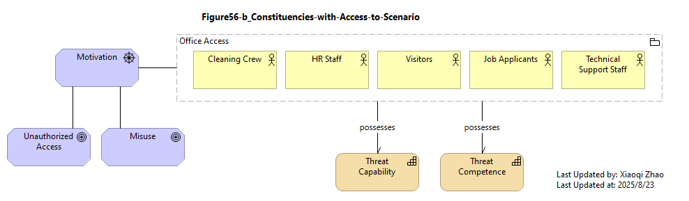
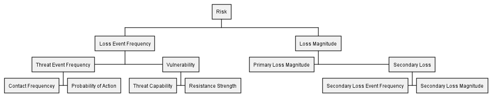
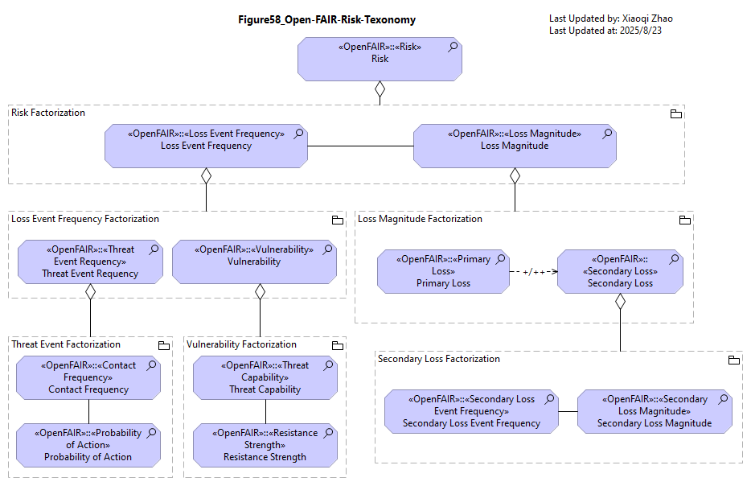
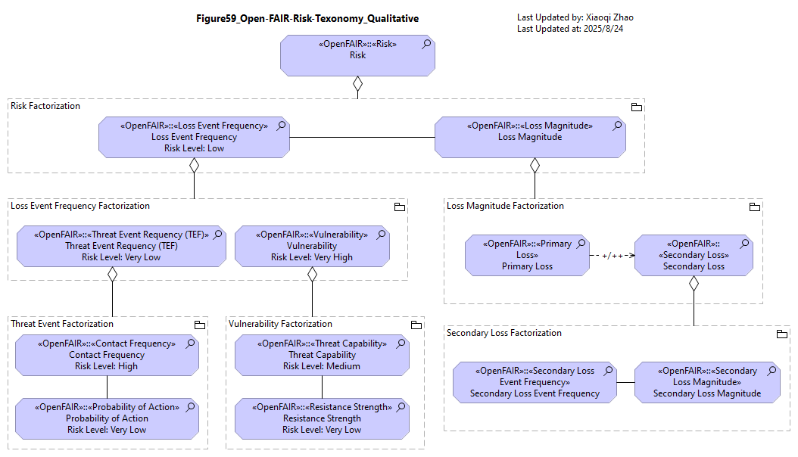
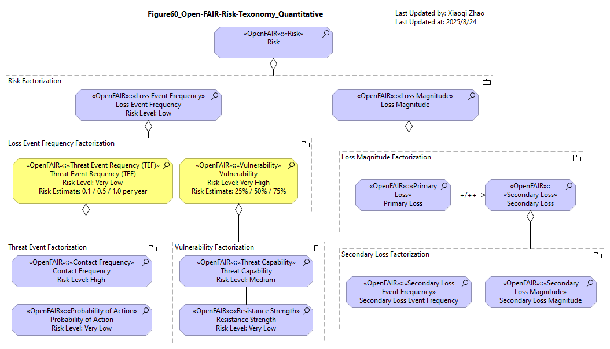

# 08 Modeling the Logical Security Architecture

- [08 Modeling the Logical Security Architecture](#08-modeling-the-logical-security-architecture)
  - [8.0 Logical Overview](#80-logical-overview)
  - [8.1 Information Assets](#81-information-assets)
    - [8.1.1 Application Components](#811-application-components)
    - [8.1.2 Security Configuration](#812-security-configuration)
    - [8.1.3 Software Defects and Malware](#813-software-defects-and-malware)
    - [8.1.4 Data Assets](#814-data-assets)
  - [8.2 Risk Modeling](#82-risk-modeling)
    - [8.2.1 Risk Modeling](#821-risk-modeling)
    - [8.2.2 The Scenario](#822-the-scenario)
  - [8.3 Application Functionality and Services](#83-application-functionality-and-services)
  - [8.4 Logical Access Management](#84-logical-access-management)
    - [8.4.1 Account](#841-account)
    - [8.4.2 Application Role](#842-application-role)
    - [8.4.3 Application Service](#843-application-service)
    - [8.4.4 Application Process and Function](#844-application-process-and-function)
    - [8.4.5 Application Interface](#845-application-interface)
  - [8.5 Logical Domains](#85-logical-domains)
  - [8.6 Timing and Events](#86-timing-and-events)
    - [8.6.1 Application Security Events](#861-application-security-events)

## 8.0 Logical Overview

The Logical Architecture documents the Solution Architect's view of the system.

In this section:
- Conceptual elements described in the previous section are applied to and guide the Application and Data Architecture
- It also proposes security properties for the ArchiMate Specification's Logical layer elements that support security analysis.

Below we're again using Protege to expand our SABSA Matrix Ontology:

Snapshot Protege Ontology File: [SABSA Matrics 2018 - Ch08](sabsa_matrices_2018_ch08.rdf)

Below Figure 54 outlines the set of artifacts and activities of the Logical Architecture:

Snapshot ArchiMate Model: [Figure 54: Developing the SABSA Logical Security Architecture](./Figure54/ArchiMate_SABSA_Figure54.archimate)

## 8.1 Information Assets

The principal information assets in this layer are software assets (applications) and data.

### 8.1.1 Application Components

Most organizations maintain a register of the applications deployed in their IT environment (it can be called Application Portfolio, or Application Catalog). The primary drivers for this register are operational: patch management, vendor support, license management, etc. Because these concerns are focused on software products rather than logical building blocks, discussion is deferred to [Chapter 9](../09_Modeling_Physical_Security_Architecture/README.md).

The kind of inventory relevant at this layer is the identification of _critical_ applications: the software upon which the organization is disproportionately reliant for achieving its primary mission.

Organizations perform a regular "Critical Application Review" to identify these dependencies. Applications on the critical list are then prioritized for risk assessment, penetration testing, monitoring, business continuity planning, audit, etc.

The most common approach to identify critical applications is simply to request a rating recertification from the Application Owner.

This approach has a few issues as of below:

- In a Service-Oriented Architecture (SOA), the use of application services can be hightly dynamic.
- A tendency for subjective bias

Below Figure 55 shows a better solution using architectural models:

Snapshot ArchiMate Model: [Figure 55: Critical Applications](./Figure55/ArchiMate_SABSA_Figure55.archimate)

Here is the Application Component Properties:

| Element | Schema File | Schema Visualization |
| --- | --- | --- |
| Application Component | [App Comp JSON](./Table34/ApplicationComponent.json) |  |

### 8.1.2 Security Configuration

«Security Configuration» is a Stereotype of `Data Object` tht declares any configuration settings that differ from the baseline (least common functionality) configuration.

It is appropriate at the Logical layer because different instances of the same building blocks may have different configurations in different contexts.

Properties match those of the baseline configuration but with values toggled between `ENABLED` and `DISABLED`.

| Element | Schema File | Schema Visualization |
| --- | --- | --- |
| «Security Configuration» | [Sec. Conf. JSON](./Table35/SecurityConfiguration.json) |  |

### 8.1.3 Software Defects and Malware

Being modeled as a «Vulnerability» (`Motivation` layer elements can be placed anywhere), it is often useful to associate functional defects with application behavior elements directly.

The Security Overlay includes a Malware stereotype of `Application Component` that can represent non-human agents or malware threat. it provides a type property that enumerates a controlled vocabulary of threat types with a default set of values drawn from the STIX™ (Structured Threat Information Expression) taxonomy.

Some reference on STIX, which ia a language and serialization format used to exchange cyber threat intelligence (CTI):

- [About STIX | STIX Project Documentation](https://stixproject.github.io/about/)
- [Introduction to STIX - GitHub Pages](https://oasis-open.github.io/cti-documentation/stix/intro.html)
- [STIX Version 2.1](https://docs.oasis-open.org/cti/stix/v2.1/cs01/stix-v2.1-cs01.html)
- [Schema | STIX Wiki](https://stix.wiki/docs/schema/)
- [STIX/TAXII for Cybersecurity Threat Intelligence](https://techexamprep.com/sec_plus/threats_attacks_vulnerabilities/threat_actors_vectors_intelligence_sources/threat_intel_sources/ais/stix_taxii/index.html)

| Element | Schema File | Schema Visualization |
| --- | --- | --- |
| «Defect» | [Defect JSON](./Table35/Defect.json) |  |
| «Malware» | [Malware JSON](./Table35/Malware.json) |  |

### 8.1.4 Data Assets

A means of tracking critical data assets is a prerequisite for their effective protection. When those assets are subject to regulation, as is the case with personal or medical data, it is also mandated by compliance.

Modeling provides a means to bind `data objects` to their business significance and show its provenance (where it comes from), how it is processed (by which `application functions` having what read/write/modify `capability`), where it goes (`flow relationships`, sometimes traversing domain boundaries), and who has `access` to it (the `business actiors` and `roles` to whom it is `served`).

The security properties that enable a `Data Object` to contribute to the protection of information include the ability to implement data-level controls for confidentiality, privacy and integrity, using various techniques of encryption, anonymization (tokenization, redaction) and integrity protection (checksum, HMAC, signature).

| Element | Schema File | Schema Visualization |
| --- | --- | --- |
| Data Object | [Data Object JSON](./Table35/DataObject.json) |  |

## 8.2 Risk Modeling

### 8.2.1 Risk Modeling

Section [4.3-risk--security-modeling-in-the-archimet-specification](../04_Align_SABSA_and_ArchiMate_Framework/README.md#43-risk--security-modeling-in-the-archimet-specification), [5.5-impact-threat-vulnerability-and-risk](../05_Motivation_Aspect/README.md#55-impact-threat-vulnerability-and-risk), and [7.2-risk-management--strategy](../07_Modeling_Conceptual_Security_Architecture/README.md#72-risk-management--strategy) described the Security Overlay's risk elements and risk management strategy without prescriptive about any particulr methodology that an organization may choose to adopt.

These high-level definition can be adapted to suit an organization's chosen risk methodology.

To illustrate the application of these concepts, this section models a scenario described in the [_Open FAIR™ Risk Analysis Example Guide_](https://www.opengroup.org/open-fair), which contains both qualitative and quantitative analyses.

### 8.2.2 The Scenario

The example scenario considers a situation in which an HR Executive commits the _security sin_ (安全恶习) of posting log-in credentials ona sticky note attached to their workstation. The Executive's office is accessible to five groups of people: consituencies of differing size, goals, motivation, access opportunity, capability, and competency.

Below Figure 56 shows how this scenario might be modeled in ArchiMate language:

Snapshot ArchiMate Model: [Figure 56: Open FAIR™ Example Scenario](./Figure56/ArchiMate_SABSA_Figure56.archimate)

The analysis described in the guide focuses on the risk poses by one of these groups: the Clearning Crew.

The Open FAIR™ Risk Taxonomy defines a structure, reproduced in below Figure 57 (Using PlantUML's [WBS Diagram](https://plantuml.com/wbs-diagram)), to analyze this risk. The assessment of any factor in the taxonomy is determined by a qualitative (risk matrix) or quantitative (mathematical) combination of its  (构成的) factors.

Source Diagram File: [Figure 57: The Open FAIR™ Risk Taxonomy](./Figure57/RiskTaxonomy.puml)

An equivalent ArchiMate representation of this model is shown in modeled in below Figure 58:

Snapshot ArchiMate Model: [Figure 58: Open FAIR™ Risk Taxonomy Modeled in ArchiMate Language](./Figure58/ArchiMate_SABSA_Figure58.archimate)

Snapshot ArchiMate Model: [Figure 59: Qualitative Example from the Open FAIR™ Risk Analysis Example Guide](./Figure59/ArchiMate_SABSA_Figure59.archimate)

Snapshot ArchiMate Model: [Figure 60: Quantitative Example from the Open FAIR™ Risk Analysis Example Guide](./Figure60/ArchiMate_SABSA_Figure60.archimate)

## 8.3 Application Functionality and Services

The Process cell of the SABSA Matrix Logical architecture addresses `application functionality and services`.

## 8.4 Logical Access Management

### 8.4.1 Account

### 8.4.2 Application Role

### 8.4.3 Application Service

### 8.4.4 Application Process and Function

### 8.4.5 Application Interface

## 8.5 Logical Domains

## 8.6 Timing and Events

### 8.6.1 Application Security Events

---

[<button type="button">«Chapter 07</button>](../07_Modeling_Conceptual_Security_Architecture/README.md) [<button type="button">Chapter 09»</button>](../09_Modeling_Physical_Security_Architecture/README.md) [<button type="button">HOME</button>](../README.md)

---

Any comments, feel free to post to the [Discussion Board](https://github.com/yasenstar/ArchiMate_SABSA/discussions).