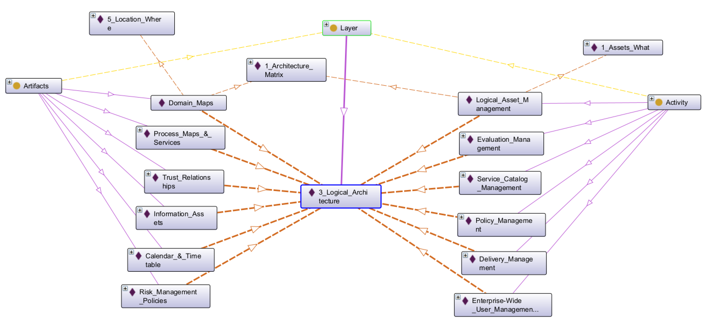
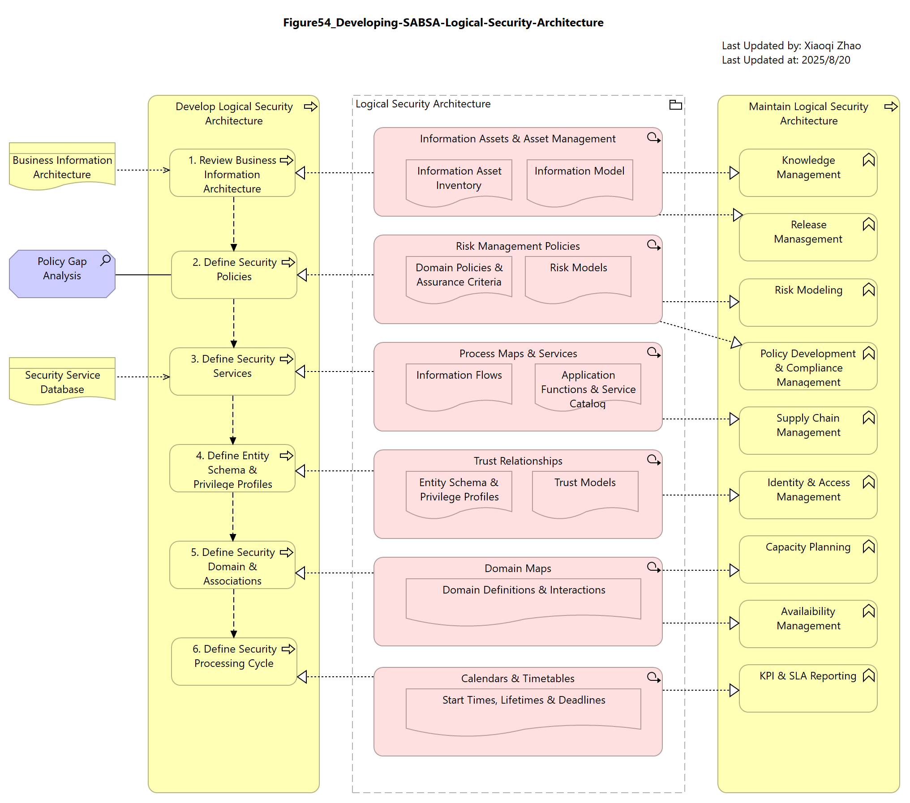
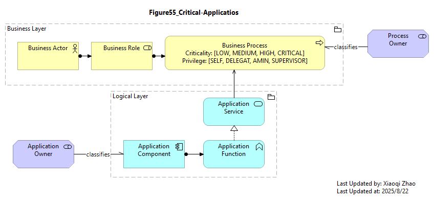
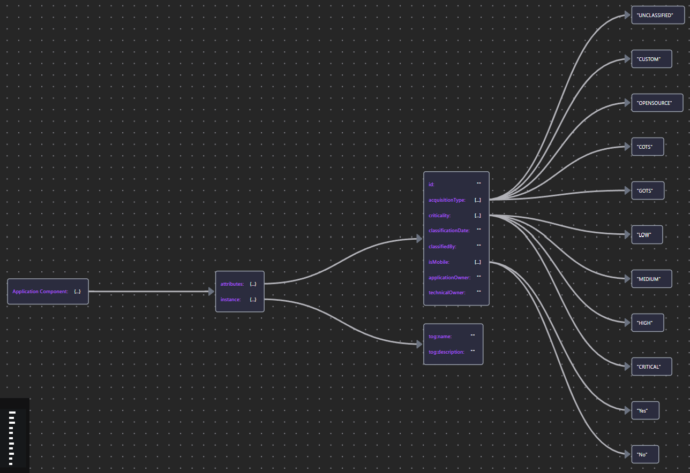

# 08 Modeling the Logical Security Architecture

- [08 Modeling the Logical Security Architecture](#08-modeling-the-logical-security-architecture)
  - [8.0 Logical Overview](#80-logical-overview)
  - [8.1 Information Assets](#81-information-assets)
    - [8.1.1 Application Components](#811-application-components)
    - [8.1.2 Security Configuration](#812-security-configuration)
    - [8.1.3 Software Defects and Malware](#813-software-defects-and-malware)
    - [8.1.4 Data Assets](#814-data-assets)
  - [8.2 Risk Modeling](#82-risk-modeling)
  - [8.3 Application Functionality and Services](#83-application-functionality-and-services)
  - [8.4 Logical Access Management](#84-logical-access-management)
  - [8.5 Logical Domains](#85-logical-domains)
  - [8.](#8)

## 8.0 Logical Overview

The Logical Architecture documents the Solution Architect's view of the system.

In this section:
- Conceptual elements described in the previous section are applied to and guide the Application and Data Architecture
- It also proposes security properties for the ArchiMate Specification's Logical layer elements that support security analysis.

Below we're again using Protege to expand our SABSA Matrix Ontology:

Snapshot Protege Ontology File: [SABSA Matrics 2018 - Ch08](sabsa_matrices_2018_ch08.rdf)

Below Figure 54 outlines the set of artifacts and activities of the Logical Architecture:

Snapshot ArchiMate Model: [Figure 54: Developing the SABSA Logical Security Architecture](./Figure54/ArchiMate_SABSA_Figure54.archimate)

## 8.1 Information Assets

The principal information assets in this layer are software assets (applications) and data.

### 8.1.1 Application Components

Most organizations maintain a register of the applications deployed in their IT environment (it can be called Application Portfolio, or Application Catalog). The primary drivers for this register are operational: patch management, vendor support, license management, etc. Because these concerns are focused on software products rather than logical building blocks, discussion is deferred to [Chapter 9](../09_Modeling_Physical_Security_Architecture/README.md).

The kind of inventory relevant at this layer is the identification of _critical_ applications: the software upon which the organization is disproportionately reliant for achieving its primary mission.

Organizations perform a regular "Critical Application Review" to identify these dependencies. Applications on the critical list are then prioritized for risk assessment, penetration testing, monitoring, business continuity planning, audit, etc.

The most common approach to identify critical applications is simply to request a rating recertification from the Application Owner.

This approach has a few issues as of below:

- In a Service-Oriented Architecture (SOA), the use of application services can be hightly dynamic.
- A tendency for subjective bias

Below Figure 55 shows a better solution using architectural models:

Snapshot ArchiMate Model: [Figure 55: Critical Applications](./Figure55/ArchiMate_SABSA_Figure55.archimate)

Here is the Application Component Properties:

| Element | Schema File | Schema Visualization |
| --- | --- | --- |
| Application Component | [App Comp JSON](./Table34/ApplicationComponent.json) |  |

### 8.1.2 Security Configuration

### 8.1.3 Software Defects and Malware

### 8.1.4 Data Assets

| Element | Schema File | Schema Visualization |
| --- | --- | --- |
| «Defect» | [Defect JSON](./Table35) |  |
| «Security Configuration» | [Sec. Conf. JSON](./Table35) |  |
| «Malware» | [Malware JSON](./Table35) |  |
| Data Object | [Data Object JSON](./Table35) |  |

---

## 8.2 Risk Modeling

---

## 8.3 Application Functionality and Services

---

## 8.4 Logical Access Management

---

## 8.5 Logical Domains

---

## 8.

---

[<button type="button">«Chapter 07</button>](../07_Modeling_Conceptual_Security_Architecture/README.md) [<button type="button">Chapter 09»</button>](../09_Modeling_Physical_Security_Architecture/README.md) [<button type="button">HOME</button>](../README.md)

---

Any comments, feel free to post to the [Discussion Board](https://github.com/yasenstar/ArchiMate_SABSA/discussions).