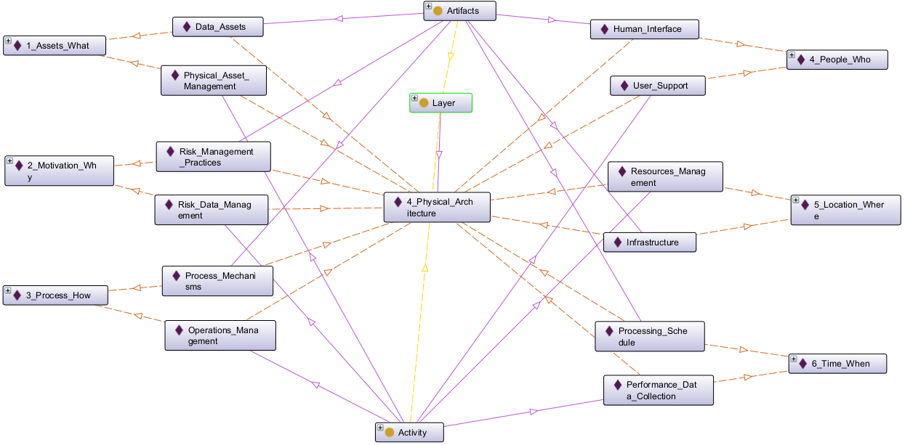
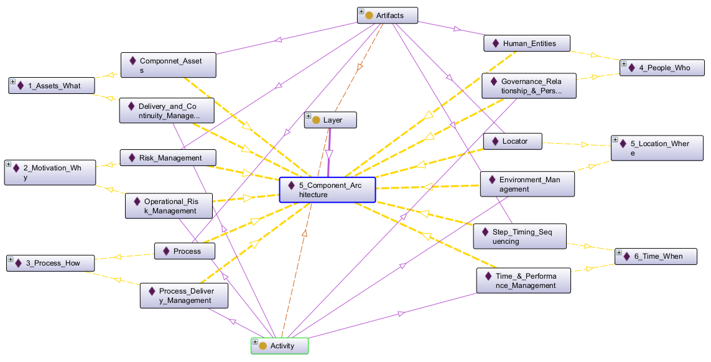
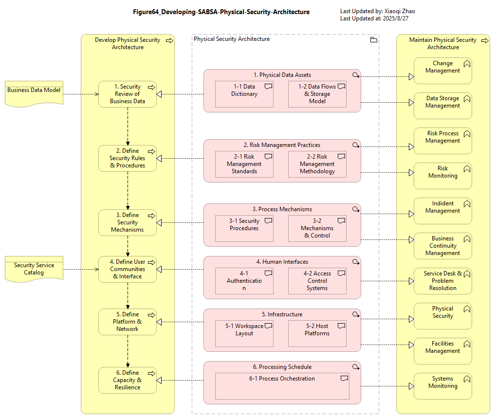
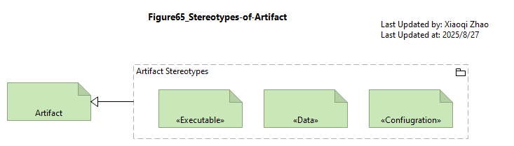
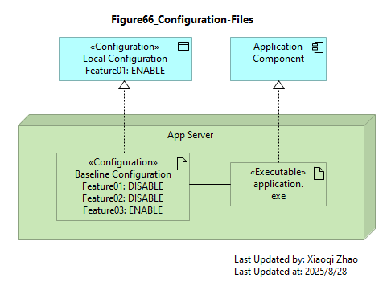

# 09 Modeling the Physical Security Architecture

- [09 Modeling the Physical Security Architecture](#09-modeling-the-physical-security-architecture)
  - [9.0 Physical Overview](#90-physical-overview)
    - [Table 38: Physical Matrix in Ontology View](#table-38-physical-matrix-in-ontology-view)
    - [Table 39: Component Matrix in Ontology View](#table-39-component-matrix-in-ontology-view)
    - [Figure 64: Developing SABSA Physical Security Architecture](#figure-64-developing-sabsa-physical-security-architecture)
  - [9.1 Data and Technology Assets](#91-data-and-technology-assets)
    - [9.1.1 Artifact](#911-artifact)
      - [9.1.1.1 Executable](#9111-executable)
      - [9.1.1.2 Data](#9112-data)
      - [9.1.1.3 Configuration](#9113-configuration)
    - [9.1.2 Device and Node](#912-device-and-node)
  - [9.2 Risk Management Practices](#92-risk-management-practices)
    - [9.2.1 Defect](#921-defect)
  - [9.3 Process Mechanisms](#93-process-mechanisms)
    - [9.3.1 Technology Functions and Services](#931-technology-functions-and-services)
    - [9.3.2 System Software](#932-system-software)
  - [9.4 Human-Mechaine Interfaces](#94-human-mechaine-interfaces)
    - [9.4.1 Technology Interface](#941-technology-interface)
  - [9.5 Physical Environment](#95-physical-environment)
  - [9.6 Timing and Interrupts](#96-timing-and-interrupts)
    - [9.6.1 Technology Security Events](#961-technology-security-events)

## 9.0 Physical Overview

### Table 38: Physical Matrix in Ontology View

Physical Artifacts:

| Assets (What) | Motivation (Why) | Process (How) | People (Who) | Location (Where) | Time (When) |
| :--- | :--- | :--- | :--- | :--- | :--- |
| Data Assets | Risk Management Practices| Process Mechanisms | Human Interface | Infrastructure | Processing Schedule |
| - Dictionary & Data Storage - Devices Inventory | - Risk Management Rules & Procedures - Risk Metadata | - Working Procedures - Application Software - Middleware - Systems - Security Mechanisms Process Control Points | - User Interface to Business Systems - Identity & Access Control Systems | - Workspaces - Host Platforms, Layout of Devices & Networks | - Timing & Sequencing of Processes & Sessions |

Physical Activities:

| Assets (What) | Motivation (Why) | Process (How) | People (Who) | Location (Where) | Time (When) |
| :--- | :--- | :--- | :--- | :--- | :--- |
| Physical Asset Management | Risk Data Management | Operations Management | User Support | Resources Management | Performance Data Collection |
| - Change Management - Platform & Data Storage Management | - Risk Procedure Management - Risk Metadata Management | - Job, Incident, Event & Disaster Recovery Management | - Service Desk - Problem Management -Request Management | - Physical & Environmental - Security Management - Real Estate & Facilities Management | - Business Systems Monitoring - Procedure Management |

Below we're again using Protege to expand our SABSA Physical Architecture Matrix Ontology:

Snapshot Protege Ontology File: [SABSA Matrics 2018 - Ch09 - Physical](./Table38/sabsa_matrices_2018_ch09-table38.rdf)

### Table 39: Component Matrix in Ontology View

Below we're again using Protege to expand our SABSA Component Architecture Matrix Ontology:

Snapshot Protege Ontology File: [SABSA Matrics 2018 - Ch08](./Table39/sabsa_matrices_2018_ch09-table39.rdf)

### Figure 64: Developing SABSA Physical Security Architecture

Snapshot ArchiMate Model: [Figure 64: Developing the SABSA Physical Security Architecture](./Figure64/ArchiMate_SABSA_Figure64.archimate)

## 9.1 Data and Technology Assets

The principal `Assets` in this cell are the persisted formats of information/knowledge (applications and data) and IT infrastructure (hardware, system software, and network components).

The "bricks & mortar" type of physicla `Assets` are described in [Section 9.5: Physical Environment](#95-physical-environment)

### 9.1.1 Artifact

In standard ArchiMate notation, `Artifact` serves as the universal passive structure element of the `Technology Layer`. It is overloaded to represent any kind of `data object` in the file system: executables, scripits, data and configuration files, databases, documents, specifications - everything in fact, except `System Software`.

The Security Overlay refines `Artifact` into sub-types that better reflect its different purposes and provides appropriate properties: see below Figure 65.

Snapshot ArchiMate Model: [Figure 65: Stereotypes of Artifact](./Figure65/ArchiMate_SABSA_Figure65.archimate)

#### 9.1.1.1 Executable

#### 9.1.1.2 Data

#### 9.1.1.3 Configuration

Snapshot ArchiMate Model: [Figure 66: Configuration Files](./Figure66/ArchiMate_SABSA_Figure66.archimate)

### 9.1.2 Device and Node

Snapshot ArchiMate Model: [Figure 67: Stereotyping Security Nodes and Devices](./Figure67)

## 9.2 Risk Management Practices

### 9.2.1 Defect

Snapshot ArchiMate Model: [Figure 68: Risk Management Practices](./Figure68)

## 9.3 Process Mechanisms

Snapshot ArchiMate Model: [Figure 69: Realization of Security Services](./Figure69)

### 9.3.1 Technology Functions and Services

| Element | Schema File | Schema Visualization |
| --- | --- | --- |
| Technology Service | [Tech Srv JSON](./Table40) |  |
| Technology Process Technology Function | [Tech Proc & Func JSON](./Table40) |  |

### 9.3.2 System Software

## 9.4 Human-Mechaine Interfaces

### 9.4.1 Technology Interface

| Element | Schema File | Schema Visualization |
| --- | --- | --- |
| Technology Interface | [Tech Int JSON](./Table40) |  |

## 9.5 Physical Environment

## 9.6 Timing and Interrupts

### 9.6.1 Technology Security Events

| Element | Schema File | Schema Visualization |
| --- | --- | --- |
| Technology Service | [Tech Srv JSON](./Table40) |  |
| Technology Service | [Tech Srv JSON](./Table40) |  |
| Technology Service | [Tech Srv JSON](./Table40) |  |
| Technology Service | [Tech Srv JSON](./Table40) |  |
| Technology Service | [Tech Srv JSON](./Table40) |  |

---

[<button type="button">«Chapter 08</button>](../08_Modeling_Logical_Security_Architecture/README.md) [<button type="button">Chapter 10»</button>](../10_Conclusion/README.md) [<button type="button">HOME</button>](../README.md)

---

Any comments, feel free to post to the [Discussion Board](https://github.com/yasenstar/ArchiMate_SABSA/discussions).