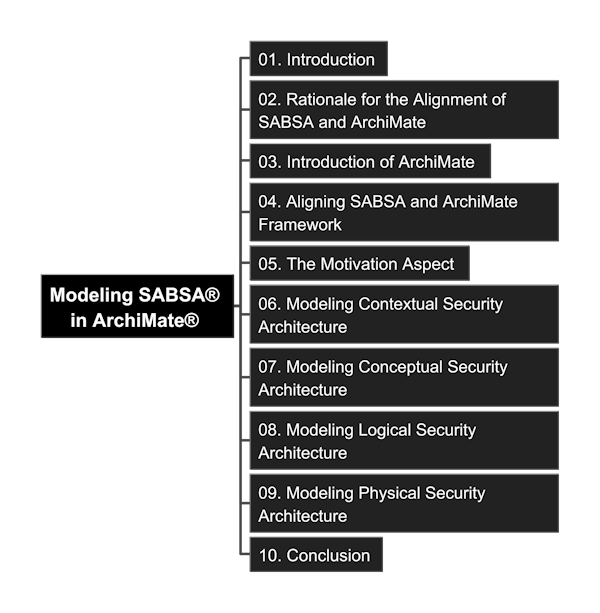

# ArchiMate_SABSA

Practice of Modeling SABSA with the ArchiMate Specification

## Resources

- This Guide "A Guide to Modeling SABSA® with the ArchiMate® Specification" can be downloaded from Open Group site: https://publications.opengroup.org/guides/archimate/g24b
- You may request variable SABSA® whitepaper from site: https://sabsa.org/white-paper-requests/, notice it would require you use your company's business email address

## Content Mindmap

Get [Freeplane](https://docs.freeplane.org/getting-started/getting-started.html) and click to open the MindMap (you need to Fork or Clone repository to your local to open it.)

You can check [markdown format of mindmap](./Modeling-SABSA-in-ArchiMate.md) if you haven't installed Freeplane yet.

## Brief Introduction

SABSA® (Sherwood Applied Business Security Architecture) is a methodology for developing risk-driven enterprise information security and information assurance architectures and for delivering security infrastructure solutions that support critical business initiatives. It is an open standard, comprising a number of frameworks, models, methods and processes, free for use by all, with no licensing required for end-user organizations who make use of the standard in developing and implementing architectures and solutions. (Source: W100 - SABSA® White Paper)

The Joint Working Group, between SABSA and the Open Group, was established around 2024, aims to following variable purpose:

- develop a settled consensus of core security elements, relationships, and properties - referred to collectively as the "Security Overlay".
- propose a reference of vocabulary, patterns, and conventions in this domain, to further enterprise security as a practice, and encourage the wider appreciation of security concepts in general and the SABSA approach in particular.
- incentivize toolmakers to facilitate support for security within their products, no need to focus on how to model the security perspective.

The practice in this repository is to detail go through the guide, and using Archi (ArchiMate® modeling tool) to create the hands-on model step-by-step, so that it can be tailored by every architecture team to their own company's EA+Security meta-model creation.

## Read and Check Detail

- [01. Introduction](./01_Introduction/README.md)
- [02. Rationale for the Alignment of SABSA® and ArchiMate®](./02_Rationale_of_Alignment/README.md)
- [03. Introduction of ArchiMate®](./03_Introduction_of_ArchiMate/README.md)
- [04. Aigning SABSA® and ArchiMate® Framework](./04_Align_SABSA_and_ArchiMate_Framework/README.md)
- [05. The Motivation Aspect](./05_Motivation_Aspect/README.md)
- [06. Modeling Contextual Security Architecture](./06_Modeling_Contextual_Security_Architecture/README.md)
- [07. Modeling Conceptual Security Architecture](./07_Modeling_Conceptual_Security_Architecture/README.md)
- [08. Modeling Logical Security Architecture](./08_Modeling_Logical_Security_Architecture/README.md)
- [09. Modeling Physical Security Architecture](./09_Modeling_Physical_Security_Architecture/README.md)
- [10. Conclusion](./10_Conclusion/README.md)

## Other Reference

Key in special character in Markdown through ALT + code (need to use number pad):

- « : Alt + 0171
- » : Alt + 0187
- ® : Copyright, Alt + 0174

Key in special characters in Markdown through HTML syntax:

- superstrike: use "sup" tag
- substrike: use "sub" tag

---

Comments are welcome, leave your thoughts in [Discussion Board](https://github.com/yasenstar/ArchiMate_SABSA/discussions).